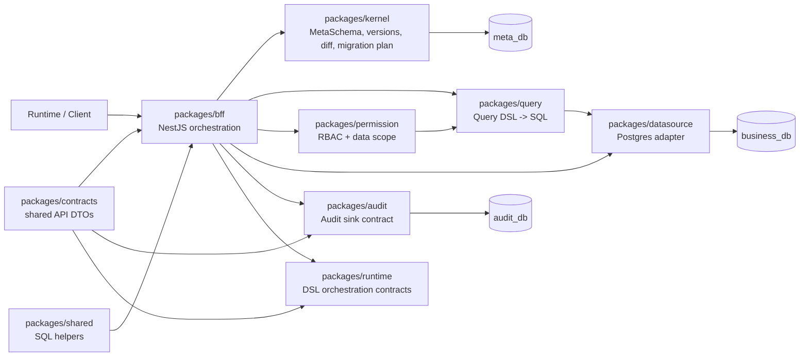

# meta-lc-platform

Core monorepo for Meta-Driven lowcode middleware.

This workspace combines reusable platform libraries under `packages/*` with a runnable NestJS middleware entry under `apps/bff-server`. The package docs describe the current code boundaries only; they do not imply that unfinished product APIs are already available.

English | [中文文档](./README_zh.md)

## Architecture

The platform keeps the frontend and runtime behind the BFF. Metadata flows through the Meta Kernel and `meta_db`; business data flows through query, permission, and datasource execution against `business_db`; audit records belong to `audit_db`.



## Package Index

| Package | Role | Docs |
| --- | --- | --- |
| `packages/contracts` | Cross-package DTOs, API contracts, and runtime event contracts. | [English](./packages/contracts/README.md) \| [中文文档](./packages/contracts/README_zh.md) |
| `packages/shared` | Shared SQL quoting and parameter formatting helpers. | [English](./packages/shared/README.md) \| [中文文档](./packages/shared/README_zh.md) |
| `packages/kernel` | MetaSchema validation, versioning, diff, migration SQL, API and permission manifest compilation. | [English](./packages/kernel/README.md) \| [中文文档](./packages/kernel/README_zh.md) |
| `packages/query` | Query DSL to SQL compilation. | [English](./packages/query/README.md) \| [中文文档](./packages/query/README_zh.md) |
| `packages/permission` | RBAC and organization data-scope decisions. | [English](./packages/permission/README.md) \| [中文文档](./packages/permission/README_zh.md) |
| `packages/datasource` | Postgres datasource configuration and execution adapter. | [English](./packages/datasource/README.md) \| [中文文档](./packages/datasource/README_zh.md) |
| `packages/migration` | Facade for compiling and applying kernel migration DSL. | [English](./packages/migration/README.md) \| [中文文档](./packages/migration/README_zh.md) |
| `packages/audit` | Query, mutation, migration, and access audit service contract. | [English](./packages/audit/README.md) \| [中文文档](./packages/audit/README_zh.md) |
| `packages/runtime` | Runtime DSL parser, dependency graph, rule/function/orchestrator, and WS event contracts. | [English](./packages/runtime/README.md) \| [中文文档](./packages/runtime/README_zh.md) |
| `packages/bff` | NestJS BFF orchestration for query, mutation, meta, cache, audit, and websocket flows. | [English](./packages/bff/README.md) \| [中文文档](./packages/bff/README_zh.md) |
| `packages/platform` | Aggregate package entry for library consumers. It is not the runnable BFF. | [English](./packages/platform/README.md) \| [中文文档](./packages/platform/README_zh.md) |

## Dependency Direction

- `contracts` and `shared` are foundation packages.
- `kernel`, `query`, `permission`, `runtime`, `datasource`, `migration`, and `audit` expose focused platform capabilities.
- `bff` composes platform capabilities into HTTP, WebSocket, query, mutation, meta, cache, and audit flows.
- `platform` is an aggregate library identity for consumers and does not package `apps/bff-server`.
- Deep cross-package imports are forbidden; import through package entrypoints.

## Runtime Entries

- `packages/bff`: library form of the NestJS BFF module.
- `apps/bff-server`: runnable middleware process entry.
- `packages/platform`: aggregate package entry for `@zhongmiao/meta-lc-platform`.

## Commands

```bash
pnpm install
pnpm -r build
pnpm -r test
pnpm lint
pnpm --filter @zhongmiao/meta-lc-bff-server start
pnpm infra:up
pnpm infra:query-gate
```

## Architectural Constraints

- Frontend and runtime consumers must go through the BFF for data access and realtime updates.
- `meta_db`, `business_db`, and `audit_db` stay separated.
- Kernel remains the structural source for metadata and migration planning.
- BFF applies orchestration and integration logic; runtime packages must not embed business-specific rules.
- DB driver access is intentionally restricted by boundary checks.

## Release Governance

- Publishable library identities use the `@zhongmiao/meta-lc-*` scope.
- Root changelogs record platform, runtime, and service-level changes.
- Package changelogs record package-local API and behavior changes.
