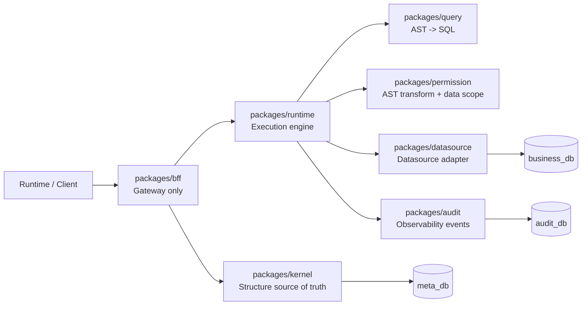

# meta-lc-platform

Core monorepo for Meta-Driven lowcode middleware.

This workspace combines reusable platform libraries under `packages/*` with a runnable NestJS middleware entry under `apps/bff-server`. The package docs describe the current code boundaries only; they do not imply that unfinished product APIs are already available.

English | [中文文档](./README_zh.md)

## Architecture

The platform keeps the frontend and runtime behind the BFF. Metadata flows through the Meta Kernel and `meta_db`; business data flows through runtime, query, permission, and datasource execution against `business_db`; audit records belong to `audit_db`.



## Package Index

| Package | Role | Docs |
| --- | --- | --- |
| `packages/runtime` | RuntimeExecutor execution engine, DAG/state execution contracts, runtime gateway facade, and WS event contracts. | [English](./packages/runtime/README.md) \| [中文文档](./packages/runtime/README_zh.md) |
| `packages/kernel` | Structural metadata contracts, MetaSchema validation, definition registry, diff, and migration SQL helpers. | [English](./packages/kernel/README.md) \| [中文文档](./packages/kernel/README_zh.md) |
| `packages/query` | Query DSL to SQL compilation. | [English](./packages/query/README.md) \| [中文文档](./packages/query/README_zh.md) |
| `packages/permission` | RBAC and organization data-scope decisions. | [English](./packages/permission/README.md) \| [中文文档](./packages/permission/README_zh.md) |
| `packages/datasource` | Postgres datasource configuration and execution adapter. | [English](./packages/datasource/README.md) \| [中文文档](./packages/datasource/README_zh.md) |
| `packages/audit` | Audit contracts and optional non-blocking runtime observability sinks. | [English](./packages/audit/README.md) \| [中文文档](./packages/audit/README_zh.md) |
| `packages/bff` | NestJS IO Gateway for HTTP/WS DTOs and thin runtime/kernel controller entrypoints. | [English](./packages/bff/README.md) \| [中文文档](./packages/bff/README_zh.md) |

## Dependency Direction

- `runtime`, `kernel`, `query`, `permission`, `datasource`, `bff`, and `audit` are the seven final architecture packages.
- Migration lifecycle scripts live under `infra/`; `packages/migration` is intentionally removed.
- Contracts live in the owning package; `contracts`, `shared`, `platform`, and `migration` packages are intentionally removed.
- Final workspace dependencies are locked as: app -> bff; bff -> runtime/kernel; runtime -> kernel/query/permission/datasource/audit; permission -> query.
- `kernel`, `query`, `datasource`, and `audit` must not depend on any workspace package.
- `runtime -> kernel` is allowed so runtime can read structure definitions; `kernel -> runtime` and `kernel -> permission` are forbidden.
- `query` compiles AST to SQL and must not depend on `datasource`, `runtime`, or `permission`.
- `bff` remains a gateway and must not own runtime orchestration, datasource wiring, permission decisions, audit wiring, or DB access.
- Deep cross-package imports are forbidden; import through package entrypoints.

## Runtime Entries

- `packages/bff`: library form of the NestJS BFF module.
- `apps/bff-server`: runnable middleware process entry.

## Commands

```bash
pnpm install
pnpm -r build
pnpm -r test
pnpm lint
pnpm --filter @zhongmiao/meta-lc-bff-server start
pnpm infra:up
pnpm infra:query-gate
```

## Architectural Constraints

- Frontend consumers enter through the BFF for HTTP and realtime protocols; page execution then crosses exactly one boundary into the runtime facade.
- `meta_db`, `business_db`, and `audit_db` stay separated.
- Kernel remains the structural source for metadata and migration planning.
- BFF is an IO Gateway only: it owns HTTP/WS DTOs, controllers, and bootstrap wiring, not orchestration or data execution.
- RuntimeExecutor is the only execution engine; runtime owns execution wiring and consumes query, permission, datasource, audit, and kernel boundaries.
- DB driver access is intentionally restricted by boundary checks.

## Release Governance

- Publishable library identities use the `@zhongmiao/meta-lc-*` scope.
- Root changelogs record platform, runtime, and service-level changes.
- Package changelogs record package-local API and behavior changes.
