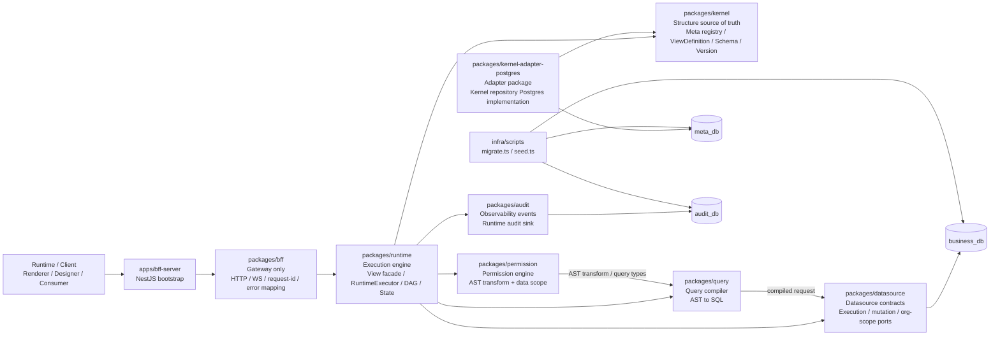

# meta-lc-platform

`meta-lc-platform` 是 Meta-Driven lowcode middleware 的核心 monorepo。

本仓库把 `packages/*` 下的可复用平台库和 `apps/bff-server` 下的可运行 NestJS middleware 入口放在同一个工作区中。本文档只描述当前代码边界，不表示尚未实现的产品接口已经可用。

[English](./README.md) | 中文文档

## 架构协作流

平台约束是所有前端与 runtime 数据访问必须经过 BFF。元数据通过 Meta Kernel 进入 `meta_db`；业务查询与变更通过 runtime、query、permission、datasource 访问 `business_db`；审计记录进入 `audit_db`。

下图表达 runtime 执行交接关系，不是 package import 依赖图。`Permission --> Query` 表示 permission transform 作用于 query AST / query type contract，且 permission 不执行 SQL。`Query --> Datasource` 表示 runtime 将 query 编译后的 SQL/request 产物交给 datasource 执行；`query` 仍然禁止依赖 `datasource`。



## 包模型

SDK 按 `7 个核心包 + N 个 adapter 包` 组织。

- 核心包拥有稳定 contract、domain/application 行为、gateway 代码与 runtime orchestration。
- Adapter 包拥有具体技术绑定，例如数据库 driver。它们可以依赖核心包和外部 driver，但核心包不能依赖 adapter。
- 当前 adapter 包为 `packages/kernel-adapter-postgres`。后续 adapter 应遵循 `*-adapter-*` 形态，并保持在七个核心包之外。

## 核心包索引

| Package | 定位 | 文档 |
| --- | --- | --- |
| `packages/runtime` | RuntimeExecutor 执行引擎、DAG/state 执行契约、runtime gateway facade 与 WS event contract。 | [English](./packages/runtime/README.md) \| [中文文档](./packages/runtime/README_zh.md) |
| `packages/kernel` | 结构元数据契约、MetaSchema 校验、definition registry、diff 与 migration SQL helper。 | [English](./packages/kernel/README.md) \| [中文文档](./packages/kernel/README_zh.md) |
| `packages/query` | Query AST / DSL 到 SQL 编译。 | [English](./packages/query/README.md) \| [中文文档](./packages/query/README_zh.md) |
| `packages/permission` | RBAC 与组织数据域决策。 | [English](./packages/permission/README.md) \| [中文文档](./packages/permission/README_zh.md) |
| `packages/datasource` | 稳定 datasource execution contract；具体实现位于 root 或 secondary adapter 入口之后。 | [English](./packages/datasource/README.md) \| [中文文档](./packages/datasource/README_zh.md) |
| `packages/audit` | 审计契约与可选、非阻塞 runtime observability sink。 | [English](./packages/audit/README.md) \| [中文文档](./packages/audit/README_zh.md) |
| `packages/bff` | NestJS IO Gateway，持有 HTTP/WS DTO、runtime controller 入口、request-id 与错误映射。 | [English](./packages/bff/README.md) \| [中文文档](./packages/bff/README_zh.md) |

## Adapter 包索引

| Package | 定位 | 文档 |
| --- | --- | --- |
| `packages/kernel-adapter-postgres` | kernel repository port 的 Postgres 实现，供 app/example composition root 装配使用。 | [English](./packages/kernel-adapter-postgres/README.md) \| [中文文档](./packages/kernel-adapter-postgres/README_zh.md) |

## SDK 使用约束

- 业务方只能从 package root 或已批准的 secondary entry 导入，例如 `@zhongmiao/meta-lc-runtime/core`、`@zhongmiao/meta-lc-datasource/postgres`、`@zhongmiao/meta-lc-audit/postgres`。
- 禁止 deep import package 内部路径，例如 `@zhongmiao/meta-lc-*` 包下的 `src/*` 子路径、`*/domain/*`、`*/application/*`、`*/infra/*` 或具体实现文件路径。
- `@zhongmiao/meta-lc-runtime` 只用于 runtime facade 函数；runtime contract、error、constant 与 event type 从 `@zhongmiao/meta-lc-runtime/core` 导入。
- Postgres adapter 只允许在 app/example composition root 或 infra script 中装配。核心包与 BFF 不得直接装配具体 Postgres adapter。
- 包内测试中出现的 `../src/domain` 或 `../src/application` 相对导入只代表内部测试覆盖，不是 SDK consumer 示例。

## 依赖方向

- `runtime`、`kernel`、`query`、`permission`、`datasource`、`bff`、`audit` 是最终 7 个核心架构包。
- Adapter 包明确不属于核心包集合；它们是由 composition root、app、example 或 infra script 消费的实现绑定。
- migration lifecycle scripts 下沉到 `infra/`；`packages/migration` 已被删除。
- contract 由所属包拥有；`contracts`、`shared`、`platform`、`migration` 包已被删除。
- 最终 workspace 依赖锁定为：app -> bff；bff -> runtime；runtime -> kernel/query/permission/datasource/audit；permission -> query。
- `kernel`、`query`、`datasource`、`audit` 禁止依赖任何 workspace package。
- 允许 `runtime -> kernel` 读取结构定义；禁止 `kernel -> runtime` 与 `kernel -> permission`。
- `query` 只负责 AST 到 SQL 编译，禁止依赖 `datasource`、`runtime` 或 `permission`。
- `bff` 只作为 gateway，不拥有 runtime orchestration、datasource wiring、permission decision、audit wiring 或 DB access。
- `bff` 禁止依赖 `kernel`；`/meta/*` 可以使用注入的 meta registry provider，任何 kernel-backed provider 都必须在 BFF package 外部装配。
- 核心包禁止导入 `@zhongmiao/meta-lc-kernel-adapter-postgres`；只有 composition root 可以装配它。
- 禁止 deep import，跨包引用必须通过 package entrypoint。

### 编译 / 执行边界

- `packages/query` 拥有 Query AST -> SQL 编译职责，禁止执行 SQL，禁止依赖 `datasource`。
- `packages/datasource` 拥有物理执行职责，接收 compiled request 或 SQL command，禁止编译 Query AST，禁止依赖 `query`、`permission` 或 `runtime`。
- `packages/permission` 只拥有 AST transform，仅允许 type-only 依赖 query 的 AST/types，禁止 value import query compiler，禁止编译 SQL，禁止执行 datasource 请求。

## 运行入口

- `packages/bff`：NestJS BFF module 的库形态。
- `apps/bff-server`：middleware 进程入口。

## Examples

- 业务 demo 放在 `examples/*`，不放入核心 packages。
- `examples/orders-demo` 拥有 orders workbench 的 seed metadata、demo mutation adapter 与 `001_orders_demo.sql`。
- 删除 `examples/` 不应影响 `packages/*` build 或 test；examples 可以依赖 packages，但 packages 永远不能依赖 examples。
- examples 仅作为演示应用，不属于核心平台包拓扑。

## 常用命令

```bash
pnpm install
pnpm -r build
pnpm -r test
pnpm lint
pnpm --filter @zhongmiao/meta-lc-bff-server start
pnpm infra:up
pnpm infra:query-gate
pnpm test:examples:orders-demo
```

## 架构约束

- 前端 consumer 通过 BFF 进入 HTTP 与实时协议；页面执行随后只跨一次边界进入 runtime facade。
- `meta_db`、`business_db`、`audit_db` 保持三库分离。
- Kernel 是元数据结构与迁移计划的来源。
- BFF 只能作为 IO Gateway，持有 HTTP/WS DTO、controller 与 bootstrap wiring，不持有 orchestration 或 data execution。
- RuntimeExecutor 是唯一执行引擎；runtime 拥有 execution wiring，并消费 query、permission、datasource、audit、kernel 边界。
- DB driver access 受 boundary check 限制。

## 发版治理

- 可发布库身份使用 `@zhongmiao/meta-lc-*` scope。
- 根 changelog 记录平台、runtime、service 级变化。
- 子包 changelog 记录包内 API 与行为变化。
- SDK Beta 封板门禁记录在 [SDK 发布 Checklist](./docs/sdk-release-checklist.md)。
