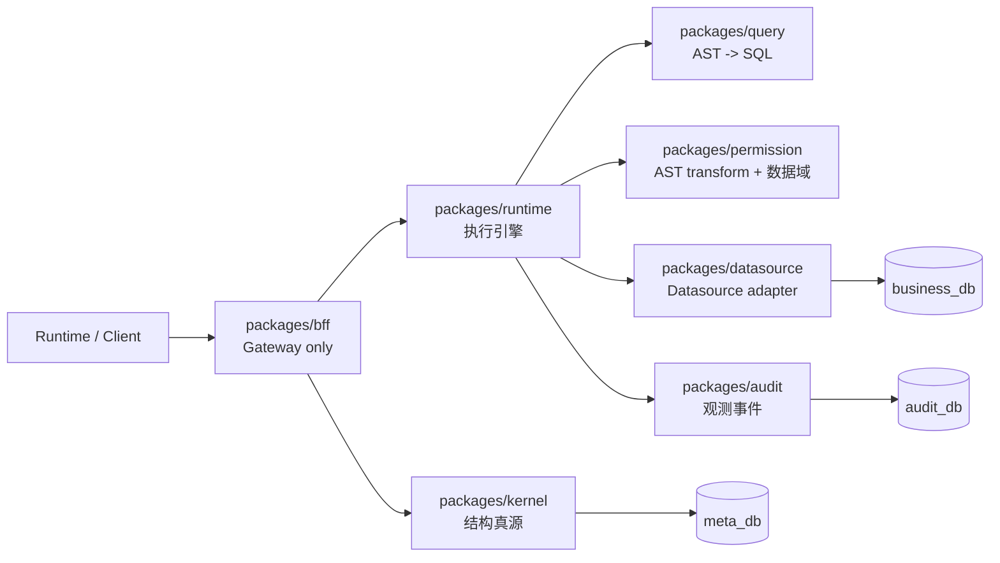

# meta-lc-platform

`meta-lc-platform` 是 Meta-Driven lowcode middleware 的核心 monorepo。

本仓库把 `packages/*` 下的可复用平台库和 `apps/bff-server` 下的可运行 NestJS middleware 入口放在同一个工作区中。本文档只描述当前代码边界，不表示尚未实现的产品接口已经可用。

[English](./README.md) | 中文文档

## 总体架构

平台约束是所有前端与 runtime 数据访问必须经过 BFF。元数据通过 Meta Kernel 进入 `meta_db`；业务查询与变更通过 runtime、query、permission、datasource 访问 `business_db`；审计记录进入 `audit_db`。



## 子包索引

| Package | 定位 | 文档 |
| --- | --- | --- |
| `packages/runtime` | RuntimeExecutor 执行引擎、DAG/state 执行契约、runtime gateway facade 与 WS event contract。 | [English](./packages/runtime/README.md) \| [中文文档](./packages/runtime/README_zh.md) |
| `packages/kernel` | 结构元数据契约、MetaSchema 校验、definition registry、diff 与 migration SQL helper。 | [English](./packages/kernel/README.md) \| [中文文档](./packages/kernel/README_zh.md) |
| `packages/query` | Query DSL 到 SQL 编译。 | [English](./packages/query/README.md) \| [中文文档](./packages/query/README_zh.md) |
| `packages/permission` | RBAC 与组织数据域决策。 | [English](./packages/permission/README.md) \| [中文文档](./packages/permission/README_zh.md) |
| `packages/datasource` | Postgres datasource 配置与执行 adapter。 | [English](./packages/datasource/README.md) \| [中文文档](./packages/datasource/README_zh.md) |
| `packages/audit` | 审计契约与可选、非阻塞 runtime observability sink。 | [English](./packages/audit/README.md) \| [中文文档](./packages/audit/README_zh.md) |
| `packages/bff` | NestJS IO Gateway，持有 HTTP/WS DTO 与 thin runtime/kernel controller 入口。 | [English](./packages/bff/README.md) \| [中文文档](./packages/bff/README_zh.md) |

## 依赖方向

- `runtime`、`kernel`、`query`、`permission`、`datasource`、`bff`、`audit` 是最终 7 个架构层包。
- migration lifecycle scripts 下沉到 `infra/`；`packages/migration` 已被删除。
- contract 由所属包拥有；`contracts`、`shared`、`platform`、`migration` 包已被删除。
- 允许 `runtime -> kernel` 读取结构定义；禁止 `kernel -> runtime`。
- `query` 只负责 AST 到 SQL 编译，禁止依赖 `datasource`。
- `bff` 只作为 gateway，不拥有 runtime orchestration、datasource wiring、permission decision 或 DB access。
- 禁止 deep import，跨包引用必须通过 package entrypoint。

## 运行入口

- `packages/bff`：NestJS BFF module 的库形态。
- `apps/bff-server`：middleware 进程入口。

## 常用命令

```bash
pnpm install
pnpm -r build
pnpm -r test
pnpm lint
pnpm --filter @zhongmiao/meta-lc-bff-server start
pnpm infra:up
pnpm infra:query-gate
```

## 架构约束

- 前端 consumer 通过 BFF 进入 HTTP 与实时协议；页面执行随后只跨一次边界进入 runtime facade。
- `meta_db`、`business_db`、`audit_db` 保持三库分离。
- Kernel 是元数据结构与迁移计划的来源。
- BFF 只能作为 IO Gateway，持有 HTTP/WS DTO、controller 与 bootstrap wiring，不持有 orchestration 或 data execution。
- RuntimeExecutor 是唯一执行引擎；runtime 拥有 execution wiring，并消费 query、permission、datasource、audit、kernel 边界。
- DB driver access 受 boundary check 限制。

## 发版治理

- 可发布库身份使用 `@zhongmiao/meta-lc-*` scope。
- 根 changelog 记录平台、runtime、service 级变化。
- 子包 changelog 记录包内 API 与行为变化。
