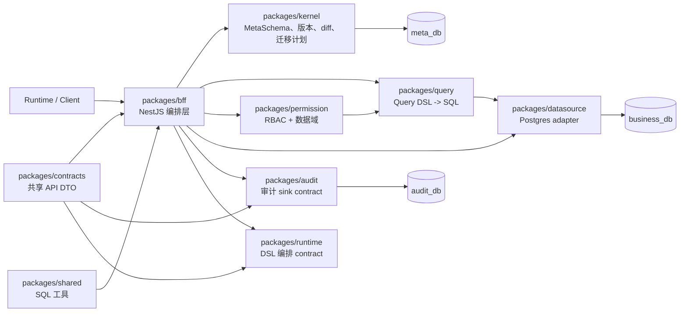

# meta-lc-platform

`meta-lc-platform` 是 Meta-Driven lowcode middleware 的核心 monorepo。

本仓库把 `packages/*` 下的可复用平台库和 `apps/bff-server` 下的可运行 NestJS middleware 入口放在同一个工作区中。本文档只描述当前代码边界，不表示尚未实现的产品接口已经可用。

[English](./README.md) | 中文文档

## 总体架构

平台约束是所有前端与 runtime 数据访问必须经过 BFF。元数据通过 Meta Kernel 进入 `meta_db`；业务查询与变更通过 query、permission、datasource 访问 `business_db`；审计记录进入 `audit_db`。



## 子包索引

| Package | 定位 | 文档 |
| --- | --- | --- |
| `packages/contracts` | 跨包 DTO、API contract、runtime event contract。 | [English](./packages/contracts/README.md) \| [中文文档](./packages/contracts/README_zh.md) |
| `packages/shared` | SQL quoting 与参数格式化共享工具。 | [English](./packages/shared/README.md) \| [中文文档](./packages/shared/README_zh.md) |
| `packages/kernel` | MetaSchema 校验、版本、diff、migration SQL、API/permission manifest 编译。 | [English](./packages/kernel/README.md) \| [中文文档](./packages/kernel/README_zh.md) |
| `packages/query` | Query DSL 到 SQL 编译。 | [English](./packages/query/README.md) \| [中文文档](./packages/query/README_zh.md) |
| `packages/permission` | RBAC 与组织数据域决策。 | [English](./packages/permission/README.md) \| [中文文档](./packages/permission/README_zh.md) |
| `packages/datasource` | Postgres datasource 配置与执行 adapter。 | [English](./packages/datasource/README.md) \| [中文文档](./packages/datasource/README_zh.md) |
| `packages/migration` | kernel migration DSL 的 compile/apply facade。 | [English](./packages/migration/README.md) \| [中文文档](./packages/migration/README_zh.md) |
| `packages/audit` | query、mutation、migration、access 审计服务 contract。 | [English](./packages/audit/README.md) \| [中文文档](./packages/audit/README_zh.md) |
| `packages/runtime` | Runtime DSL parser、dependency graph、rule/function/orchestrator、WS event contract。 | [English](./packages/runtime/README.md) \| [中文文档](./packages/runtime/README_zh.md) |
| `packages/bff` | NestJS BFF 编排层，串联 query、mutation、meta、cache、audit、websocket。 | [English](./packages/bff/README.md) \| [中文文档](./packages/bff/README_zh.md) |
| `packages/platform` | 面向库消费者的聚合入口，不是可运行 BFF。 | [English](./packages/platform/README.md) \| [中文文档](./packages/platform/README_zh.md) |

## 依赖方向

- `contracts` 和 `shared` 是底座包。
- `kernel`、`query`、`permission`、`runtime`、`datasource`、`migration`、`audit` 提供聚焦的平台能力。
- `bff` 把这些能力编排为 HTTP、WebSocket、query、mutation、meta、cache、audit 流程。
- `platform` 是面向消费者的聚合包身份，不打包 `apps/bff-server`。
- 禁止 deep import，跨包引用必须通过 package entrypoint。

## 运行入口

- `packages/bff`：NestJS BFF module 的库形态。
- `apps/bff-server`：middleware 进程入口。
- `packages/platform`：`@zhongmiao/meta-lc-platform` 聚合包入口。

## 常用命令

```bash
pnpm install
pnpm -r build
pnpm -r test
pnpm lint
pnpm --filter @zhongmiao/meta-lc-bff-server start
pnpm infra:up
pnpm infra:query-gate
```

## 架构约束

- 前端和 runtime consumer 的数据访问与实时推送必须经过 BFF。
- `meta_db`、`business_db`、`audit_db` 保持三库分离。
- Kernel 是元数据结构与迁移计划的来源。
- BFF 承担编排与集成逻辑；runtime 包不内嵌业务专用规则。
- DB driver access 受 boundary check 限制。

## 发版治理

- 可发布库身份使用 `@zhongmiao/meta-lc-*` scope。
- 根 changelog 记录平台、runtime、service 级变化。
- 子包 changelog 记录包内 API 与行为变化。
