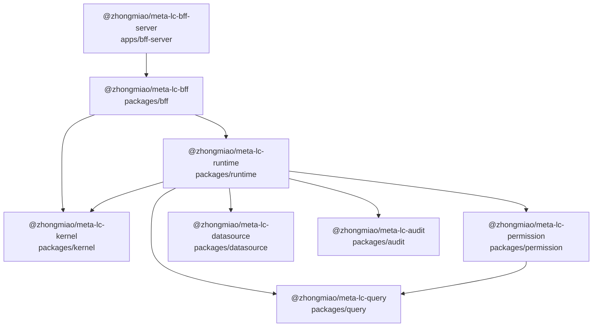

# meta-lc-platform 包依赖拓扑图

生成口径：

- 范围：`pnpm-workspace.yaml` 中的 `packages/*` 与 `apps/*`。
- 主图：只统计生产代码 `src/**/*.ts`。
- 边方向：`A --> B` 表示 **A 的源码 import/export/require 了 B**。
- `packages/migration` 已删除；migration lifecycle 下沉到 `infra/` scripts，并复用 `kernel` 内部能力。
- `packages/contracts`、`packages/shared`、`packages/platform` 已删除；contract 归属具体架构层包。

## 拓扑图

## 分层视图

按 import 方向从入口到基础包看：

1. `@zhongmiao/meta-lc-bff-server`
2. `@zhongmiao/meta-lc-bff`
3. `@zhongmiao/meta-lc-runtime`, `@zhongmiao/meta-lc-kernel`
4. `@zhongmiao/meta-lc-permission`, `@zhongmiao/meta-lc-datasource`, `@zhongmiao/meta-lc-audit`
5. `@zhongmiao/meta-lc-query`

当前生产代码包依赖图没有发现环。

## 架构结论

- `runtime` 是唯一执行核心，持有 `ExecutionPlan`、`ExecutionNode`、`Expression`、`RuntimeContext` 等执行契约。
- `kernel` 是结构真源，持有 `MetaSchema`、`ViewDefinition`、`NodeDefinition`、`DatasourceDefinition`、`PermissionPolicy`。
- `bff` 是 IO Gateway，只持有 HTTP/WS DTO、controller、bootstrap wiring、gateway config、gateway cache 与 thin Kernel integration。
- `bff` 只能依赖 `runtime` 与 `kernel`；不得直接依赖 `query`、`permission`、`datasource` 或 `pg`。
- `datasource` 与 `audit` 不得反向依赖 `runtime`；`query` 不得依赖 `datasource`。
- `kernel`、`query`、`datasource`、`audit` 禁止依赖任何 workspace package；`kernel` 可持有 meta DB persistence，但不得依赖 `runtime`、`query`、`permission`、`datasource`、`audit` 或 `bff`。
- `permission` 只能依赖 `query`；kernel 的 `PermissionPolicy.scope` 与 permission runtime data-scope 类型只共享字符串语义，不共享包依赖。
- `infra/` 承载 bootstrap SQL、docker、query-gate 等运维脚本，不作为 workspace package。
