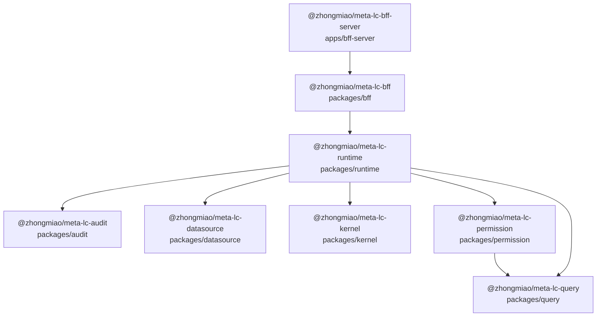
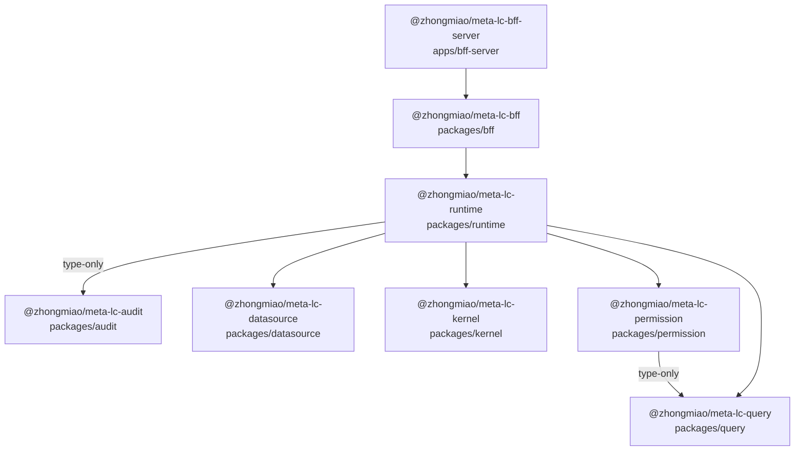
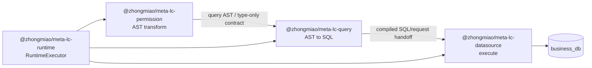

# meta-lc-platform 包依赖拓扑图

生成口径：

- 生成脚本：`pnpm docs:topology` / `node scripts/generate-package-dependency-topology.mjs`。
- 范围：`pnpm-workspace.yaml` 中的 `packages/*` 与 `apps/*`。
- `examples/*`、`infra/*`、`scripts/*` 不参与生产 package 拓扑。
- Manifest 图：统计 `package.json` 中的 workspace `dependencies` / `peerDependencies`。
- Source 图：只统计生产代码 `src/**/*.ts` 的 workspace `import` / `export from` / `require` / dynamic `import()`。
- 边方向：`A --> B` 表示 **A 依赖 B**。
- `type-only` 表示当前源码边只来自 `import type` / `export type from`。
- `packages/migration` 已删除；migration lifecycle 下沉到 `infra/` scripts，并复用 `kernel` 内部能力。
- `packages/contracts`、`packages/shared`、`packages/platform` 已删除；contract 归属具体架构层包。

## Manifest 依赖拓扑

这张图表示 package manifest 声明的 workspace 依赖，也是边界规则允许的包级依赖形态。

## Source Import 拓扑

这张图表示当前生产源码真实 import 关系。封板口径要求 `bff` 不直接 import `kernel`；`/meta/*` 如需 kernel-backed 数据，必须通过 BFF 包外注入的 meta registry provider 装配。

## Source Import 明细

- `@zhongmiao/meta-lc-bff` -> `@zhongmiao/meta-lc-runtime`
  - value: `packages/bff/src/bootstrap/app.module.ts`
  - value: `packages/bff/src/controller/http/view.controller.ts`
  - type-only: `packages/bff/src/controller/ws/runtime/broadcast.bus.ts`
  - type-only: `packages/bff/src/controller/ws/runtime/replay.store.ts`
  - type-only: `packages/bff/src/controller/ws/runtime/runtime-ws.interface.ts`
  - type-only: `packages/bff/src/controller/ws/runtime/runtime-ws.type.ts`
  - value: `packages/bff/src/controller/ws/runtime/ws.gateway.ts`
- `@zhongmiao/meta-lc-bff-server` -> `@zhongmiao/meta-lc-bff`
  - value: `apps/bff-server/src/main.ts`
- `@zhongmiao/meta-lc-permission` -> `@zhongmiao/meta-lc-query` (type-only)
  - type-only: `packages/permission/src/domain/permission-ast-transform.ts`
- `@zhongmiao/meta-lc-runtime` -> `@zhongmiao/meta-lc-audit` (type-only)
  - type-only: `packages/runtime/src/application/executor/query-executor.ts`
  - type-only: `packages/runtime/src/application/executor/runtime-audit.ts`
  - type-only: `packages/runtime/src/application/executor/runtime-executor.ts`
  - type-only: `packages/runtime/src/application/executor/runtime-view-executor.ts`
  - type-only: `packages/runtime/src/types/shared.types.ts`
- `@zhongmiao/meta-lc-runtime` -> `@zhongmiao/meta-lc-datasource`
  - type-only: `packages/runtime/src/application/executor/query-executor.ts`
  - type-only: `packages/runtime/src/application/executor/runtime-executor.ts`
  - value: `packages/runtime/src/application/executor/runtime-view-executor.ts`
  - type-only: `packages/runtime/src/infra/adapter/query.adapter.ts`
  - type-only: `packages/runtime/src/types/shared.types.ts`
- `@zhongmiao/meta-lc-runtime` -> `@zhongmiao/meta-lc-kernel`
  - type-only: `packages/runtime/src/application/compiler/plan-builder.ts`
  - type-only: `packages/runtime/src/application/compiler/view-compiler.ts`
  - type-only: `packages/runtime/src/application/executor/merge-executor.ts`
  - type-only: `packages/runtime/src/application/executor/mutation-executor.ts`
  - type-only: `packages/runtime/src/application/executor/node-executor.ts`
  - type-only: `packages/runtime/src/application/executor/query-executor.ts`
  - value: `packages/runtime/src/application/executor/runtime-view-executor.ts`
  - type-only: `packages/runtime/src/application/executor/runtime-view-executor.ts`
  - type-only: `packages/runtime/src/types/shared.types.ts`
- `@zhongmiao/meta-lc-runtime` -> `@zhongmiao/meta-lc-permission`
  - type-only: `packages/runtime/src/application/executor/query-executor.ts`
  - type-only: `packages/runtime/src/application/executor/runtime-view-executor.ts`
  - value: `packages/runtime/src/infra/adapter/query.adapter.ts`
- `@zhongmiao/meta-lc-runtime` -> `@zhongmiao/meta-lc-query`
  - type-only: `packages/runtime/src/application/executor/query-executor.ts`
  - value: `packages/runtime/src/infra/adapter/query.adapter.ts`

## Runtime 执行流 / Execution Handoff

这张图表示 runtime 执行链路中的产物流转，不表示 workspace package import dependency。`Query --> Datasource` 只表示 query compiler 产生 compiled SQL/request 后，由 runtime 交给 datasource adapter 执行；`packages/query` 仍然禁止依赖 `packages/datasource`。

## 分层视图

按 package manifest 依赖方向从入口到基础包看：

1. `@zhongmiao/meta-lc-bff-server`
2. `@zhongmiao/meta-lc-bff`
3. `@zhongmiao/meta-lc-runtime`
4. `@zhongmiao/meta-lc-kernel`, `@zhongmiao/meta-lc-permission`, `@zhongmiao/meta-lc-datasource`, `@zhongmiao/meta-lc-audit`
5. `@zhongmiao/meta-lc-query`

当前生产源码包 import 图没有发现环。

## 架构结论

- `runtime` 是唯一执行核心，持有 `ExecutionPlan`、`ExecutionNode`、`Expression`、`RuntimeContext` 等执行契约。
- `kernel` 是结构真源，持有 `MetaSchema`、`ViewDefinition`、`NodeDefinition`、`DatasourceDefinition`、`PermissionPolicy`。
- `bff` 是 IO Gateway，只持有 HTTP/WS DTO、controller、bootstrap wiring、gateway config、gateway cache 与 provider-backed meta registry integration。
- `bff` 只能依赖 `runtime`；不得直接依赖 `kernel`、`query`、`permission`、`datasource`、`audit` 或 `pg`。
- `/meta/*` 保留只读 HTTP envelope，但必须通过注入的 meta registry provider 读取数据；kernel-backed provider 只能在 BFF package 外部装配。
- `datasource` 与 `audit` 不得反向依赖 `runtime`；`query` 不得依赖 `datasource`。
- `kernel`、`query`、`datasource`、`audit` 禁止依赖任何 workspace package；`kernel` 可持有 meta DB persistence，但不得依赖 `runtime`、`query`、`permission`、`datasource`、`audit` 或 `bff`。
- `permission` 只能 type-only 依赖 `query` 的 AST/types；禁止 value import query compiler，禁止编译 SQL 或执行 datasource。
- `Query --> Datasource` 只允许表示 runtime 执行链路中的 compiled SQL/request handoff，不表示 `packages/query` import `packages/datasource`。
- `infra/` 承载 bootstrap SQL、docker、query-gate 等运维脚本，不作为 workspace package。
- `examples/` 承载业务 demo，不参与生产 package import 拓扑。`examples/orders-demo` 可以依赖核心 packages；核心 packages 与 apps 不得依赖 `examples/*`，删除 `examples/` 后 `packages/*` 仍必须能 build/test。
