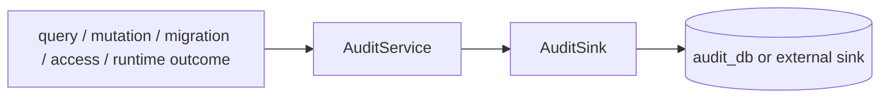

# @zhongmiao/meta-lc-audit

English | [中文文档](./README_zh.md)

## Package Role

`audit` defines audit log shapes and a pluggable audit service/sink contract for query, mutation, migration, access, and runtime observability events.

## Responsibilities

- Define audit log interfaces for mutation, migration, and access events.
- Own `QueryAuditLog` and audit status contracts.
- Provide `AuditService` with an injectable sink.
- Provide non-blocking runtime observability event contracts for plan, node, permission, and datasource execution.
- Default to a no-op sink when no persistence implementation is supplied.

## Relationship With Other Packages

- Owns audit contracts directly; it does not depend on a transitional contracts package.
- BFF can call audit service or equivalent integration after query/mutation outcomes.
- Runtime can emit observability events through an optional `RuntimeAuditObserver`; observer failures must not affect execution semantics.
- Migration orchestration can report migration audit records through this contract.
- Persistence details belong to the sink implementation or BFF integration layer.

## Minimal Flow



## Commands

```bash
pnpm --filter @zhongmiao/meta-lc-audit build
pnpm --filter @zhongmiao/meta-lc-audit test
```

## Boundary Notes

- Keep audit persistence pluggable through `AuditSink`.
- Keep runtime observability optional and non-blocking.
- Do not couple this package to NestJS controllers or concrete BFF request handling.
