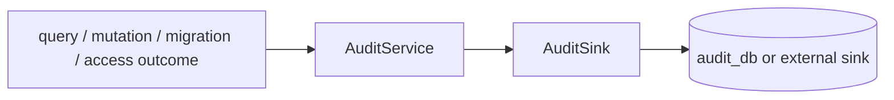

# @zhongmiao/meta-lc-audit

English | [中文文档](./README_zh.md)

## Package Role

`audit` defines audit log shapes and a pluggable audit service/sink contract for query, mutation, migration, and access events.

## Responsibilities

- Define audit log interfaces for mutation, migration, and access events.
- Reuse `QueryAuditLog` from `contracts`.
- Provide `AuditService` with an injectable sink.
- Default to a no-op sink when no persistence implementation is supplied.

## Relationship With Other Packages

- Depends on `contracts` for query audit log shape.
- BFF can call audit service or equivalent integration after query/mutation outcomes.
- Migration orchestration can report migration audit records through this contract.
- Persistence details belong to the sink implementation or BFF integration layer.

## Minimal Flow



## Commands

```bash
pnpm --filter @zhongmiao/meta-lc-audit build
pnpm --filter @zhongmiao/meta-lc-audit test
```

## Boundary Notes

- Keep audit persistence pluggable through `AuditSink`.
- Do not couple this package to NestJS controllers or concrete BFF request handling.
