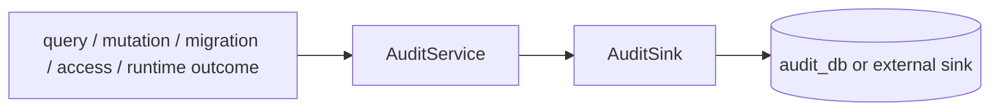

# @zhongmiao/meta-lc-audit

English | [中文文档](./README_zh.md)

## Package Role

`audit` defines audit log shapes and a pluggable audit service/sink contract for query, mutation, migration, access, and runtime observability events. The package root exposes contracts and application services; the optional Postgres sink is exposed through `@zhongmiao/meta-lc-audit/postgres`.

## Responsibilities

- Define audit log interfaces for mutation, migration, and access events.
- Own `QueryAuditLog` and audit status contracts.
- Provide `AuditService` with an injectable sink.
- Provide non-blocking runtime observability event contracts for plan, node, permission, and datasource execution.
- Default to a no-op sink when no persistence implementation is supplied.
- Expose Postgres persistence only through the `/postgres` secondary entry.

## Relationship With Other Packages

- Upstream: `runtime`.
- Downstream: `audit_db` or an external sink; audit has no workspace package dependencies.
- Owns audit contracts directly; it does not depend on a transitional contracts package.
- Runtime can emit observability events through an optional `RuntimeAuditObserver`; observer failures must not affect execution semantics.
- Migration orchestration can report migration audit records through this contract.
- Persistence details belong to sink implementations such as the optional Postgres runtime audit sink, not to BFF orchestration.
- Package root does not export Postgres persistence.

## Minimal Flow



## Commands

```bash
pnpm --filter @zhongmiao/meta-lc-audit build
pnpm --filter @zhongmiao/meta-lc-audit test
```

## Postgres Secondary Entry

The package root does not install or expose Postgres persistence by default. Consumers that import `@zhongmiao/meta-lc-audit/postgres` must install a compatible `pg` version in their composition root.

## Boundary Notes

- Keep audit persistence pluggable through `AuditSink`.
- Import Postgres persistence from `@zhongmiao/meta-lc-audit/postgres`, not the package root.
- Keep runtime observability optional and non-blocking.
- Do not couple this package to NestJS controllers or concrete BFF request handling.
