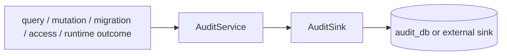

# @zhongmiao/meta-lc-audit

[English](./README.md) | 中文文档

## 包定位

`audit` 定义 query、mutation、migration、access 与 runtime observability 事件的 audit log 形状，以及可插拔的 audit service/sink contract。包根入口只暴露 contract 与 application service；可选 Postgres sink 通过 `@zhongmiao/meta-lc-audit/postgres` 暴露。

## 核心职责

- 定义 mutation、migration、access audit log interface。
- 直接拥有 `QueryAuditLog` 与 audit status contract。
- 提供可注入 sink 的 `AuditService`。
- 提供面向 plan、node、permission、datasource execution 的非阻塞 runtime observability event contract。
- 未提供 persistence implementation 时默认使用 no-op sink。
- Postgres persistence 只通过 `/postgres` secondary entry 暴露。

## 与其他包关系

- 上游：`runtime`。
- 下游：`audit_db` 或外部 sink；audit 不依赖任何 workspace package。
- 直接拥有 audit contract，不再依赖过渡 `contracts` 包。
- Runtime 可通过可选 `RuntimeAuditObserver` 发出 observability event；observer 失败不得影响执行语义。
- Migration orchestration 可通过此 contract 上报 migration audit record。
- 持久化细节属于可选 Postgres runtime audit sink 等 sink implementation，不属于 BFF orchestration。
- 包根入口不导出 Postgres persistence。

## 最小闭环



## 常用命令

```bash
pnpm --filter @zhongmiao/meta-lc-audit build
pnpm --filter @zhongmiao/meta-lc-audit test
```

## 边界约束

- 通过 `AuditSink` 保持 audit persistence 可插拔。
- Postgres persistence 必须从 `@zhongmiao/meta-lc-audit/postgres` 导入，而不是包根。
- runtime observability 必须保持可选、非阻塞。
- 不把本包耦合到 NestJS controller 或具体 BFF request handling。
