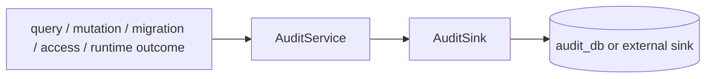

# @zhongmiao/meta-lc-audit

[English](./README.md) | 中文文档

## 包定位

`audit` 定义 query、mutation、migration、access 与 runtime observability 事件的 audit log 形状，以及可插拔的 audit service/sink contract。

## 核心职责

- 定义 mutation、migration、access audit log interface。
- 复用 `contracts` 中的 `QueryAuditLog`。
- 提供可注入 sink 的 `AuditService`。
- 提供面向 plan、node、permission、datasource execution 的非阻塞 runtime observability event contract。
- 未提供 persistence implementation 时默认使用 no-op sink。

## 与其他包关系

- 依赖 `contracts` 获取 query audit log 形状。
- BFF 可在 query/mutation 结果后调用 audit service 或等价 integration。
- Runtime 可通过可选 `RuntimeAuditObserver` 发出 observability event；observer 失败不得影响执行语义。
- Migration orchestration 可通过此 contract 上报 migration audit record。
- 持久化细节属于 sink implementation 或 BFF integration layer。

## 最小闭环



## 常用命令

```bash
pnpm --filter @zhongmiao/meta-lc-audit build
pnpm --filter @zhongmiao/meta-lc-audit test
```

## 边界约束

- 通过 `AuditSink` 保持 audit persistence 可插拔。
- runtime observability 必须保持可选、非阻塞。
- 不把本包耦合到 NestJS controller 或具体 BFF request handling。
