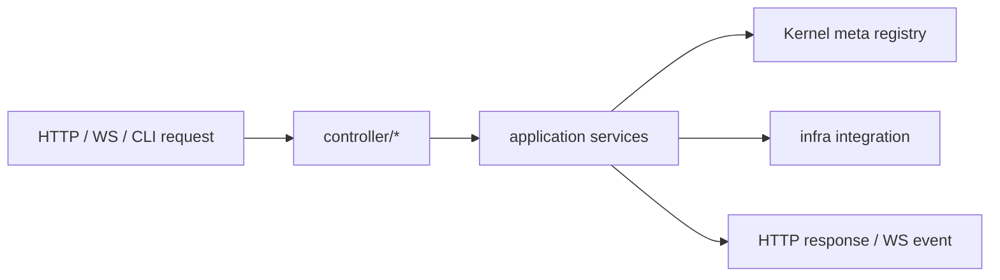

# @zhongmiao/meta-lc-bff

English | [中文文档](./README_zh.md)

## Package Role

`bff` is the NestJS Gateway boundary package. It keeps protocol entry points, Runtime invocation, domain model, infrastructure integrations, bootstrap logic, and shared contracts in strict layers; it must not own query or mutation orchestration.

BFF reads view definitions from the Kernel-backed meta registry before invoking the Runtime facade; it does not publish metadata or execute registry migrations itself.

## Source Layout

```text
bff/src/
├── controller/
│   ├── http/
│   ├── ws/
│   │   └── runtime/
│   │       ├── ws.gateway.ts
│   │       ├── broadcast.bus.ts
│   │       ├── health.controller.ts
│   │       ├── operations.state.ts
│   │       └── replay.store.ts
│   └── cli/
├── application/
│   ├── services/
│   ├── types/
│   └── interfaces/
├── domain/
│   ├── entities/
│   ├── value-objects/
│   ├── types/
│   └── interfaces/
├── infra/
│   ├── repository/
│   ├── integration/
│   ├── cache/
│   ├── types/
│   └── interfaces/
├── contracts/
│   ├── types/
│   └── interfaces/
├── dto/
├── mapper/
├── constants/
├── common/
├── config/
├── bootstrap/
├── utils/
└── index.ts
```

## Folder Constraints

- `controller/http/**` is the HTTP API entry layer.
- `controller/ws/**` is the WebSocket entry layer. Runtime WebSocket files must stay under `controller/ws/runtime/**`.
- `controller/cli/**` is the CLI/RPC entry layer.
- `application/**` owns application services and runtime invocation. It must not contain transport controllers, direct SQL implementation, or query/mutation orchestration.
- `domain/**` owns entities, value objects, domain data shapes, and domain behavior contracts.
- `infra/**` owns repository, integration, cache, and external dependency implementations.
- `contracts/**` owns cross-layer request/response shapes and behavior contracts shared by entry/application layers.
- `dto/**` is class-only. Do not declare `type` or `interface` in DTO files.
- `mapper/**` owns conversion between protocol DTOs, contracts, and application inputs.
- `constants/**` owns package-level constants and provider tokens.
- `config/**` owns environment/config loading.
- `common/**` owns small framework-level helpers and exception utilities only.
- `bootstrap/**` owns Nest module wiring, process startup, and migration/bootstrap runners.
- `utils/**` is reserved for pure helpers and should stay small.

## Type And Interface Rules

- `*.interface.ts` means behavior contracts or structural abstractions and may only export `interface`.
- `*.type.ts` means data shapes or structural composition and may only export `type`.
- Do not mix `export type` inside `*.interface.ts`.
- Do not mix `export interface` inside `*.type.ts`.
- Do not declare TypeScript `type` or `interface` in controller/service/infra implementation files.
- Do not add `types/index.ts` or `interfaces/index.ts` aggregators.

## Dependency Direction

```text
controller -> application -> domain -> infra
```

`bootstrap` wires the layers together. `common`, `contracts`, `config`, and `constants` may be shared support layers, but they must not import implementation layers back upward.

## Minimal Flow



## Commands

```bash
pnpm --filter @zhongmiao/meta-lc-bff build
pnpm --filter @zhongmiao/meta-lc-bff test
pnpm --filter @zhongmiao/meta-lc-bff start
```

## Boundary Notes

- WebSocket is an entry protocol layer, not infra and not application orchestration.
- Direct DB driver use must stay inside approved edge files and pass `pnpm test:boundaries`.
- Runtime UI and kernel source-of-truth logic must not be moved into BFF.
- Do not restore legacy `/query` or `/mutation` endpoints; page data requests must use `POST /view/:name`.
- Do not add `application/orchestrator/**`; BFF is only a Gateway invoking Runtime.
