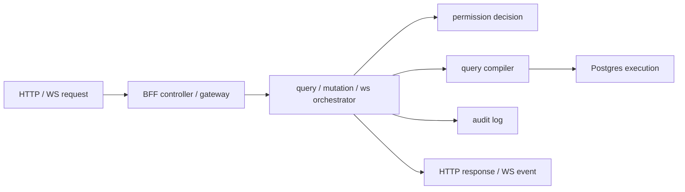

# @zhongmiao/meta-lc-bff

English | [中文文档](./README_zh.md)

## Package Role

`bff` is the NestJS middleware orchestration package. It exposes the BFF module, query/mutation controllers, meta gateway, cache, audit integration, Postgres execution integration, organization-scope integration, and runtime websocket gateway.

## Responsibilities

- Accept HTTP query, mutation, health, and meta requests.
- Orchestrate query compilation, permission decisions, datasource execution, audit logging, caching, and response shaping.
- Coordinate mutation execution and audit outcomes.
- Serve runtime websocket events and replay/health support.
- Bootstrap meta, business, and audit database baselines for dev/test environments when configured.

## Relationship With Other Packages

- Uses `contracts` for API request/response shapes.
- Uses `query` and `permission` for server-side query and access decisions.
- Uses shared helpers and direct Postgres integration at approved BFF edge files.
- Should compose `kernel` for metadata versioning and migration orchestration as meta APIs mature.
- `apps/bff-server` is the runnable process entry built from this package.

## Minimal Flow



## Commands

```bash
pnpm --filter @zhongmiao/meta-lc-bff build
pnpm --filter @zhongmiao/meta-lc-bff test
pnpm --filter @zhongmiao/meta-lc-bff start
```

## Boundary Notes

- BFF is the integration boundary for frontend and runtime data access.
- Keep direct DB driver use inside approved edge files and boundary checks.
- Do not move runtime UI or package-level kernel source-of-truth logic into BFF.
