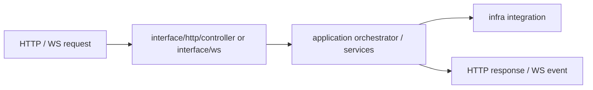

# @zhongmiao/meta-lc-bff

English | [中文文档](./README_zh.md)

## Package Role

`bff` is the NestJS boundary package. It keeps the application orchestration core separate from the HTTP/WS entry layer, infrastructure integrations, bootstrap logic, and shared helpers.

## Source Layout

```text
bff/src/
├── application/
│   ├── orchestrator/
│   │   ├── aggregation.orchestrator.ts
│   │   ├── mutation.orchestrator.ts
│   │   ├── query.orchestrator.ts
│   │   └── query-pipeline.orchestrator.ts
│   ├── services/
│   │   └── meta-registry.service.ts
│   └── index.ts
├── interface/
│   ├── http/
│   │   └── controller/
│   │       ├── meta.controller.ts
│   │       ├── query.controller.ts
│   │       └── view.controller.ts
│   ├── ws/
│   │   ├── runtime-ws-broadcast.bus.ts
│   │   ├── runtime-ws-health.controller.ts
│   │   ├── runtime-ws-operations.state.ts
│   │   ├── runtime-ws-replay.store.ts
│   │   └── ws.gateway.ts
│   ├── contracts/
│   │   ├── meta-registry.contract.ts
│   │   └── view.contract.ts
│   ├── protocols/
│   │   ├── meta.http.ts
│   │   └── view.http.ts
│   └── index.ts
├── infra/
│   ├── cache/
│   ├── integration/
│   │   ├── audit.service.ts
│   │   ├── org-scope.service.ts
│   │   └── postgres-query.service.ts
│   └── index.ts
├── bootstrap/
│   ├── app.module.ts
│   ├── bootstrap.service.ts
│   ├── cli.ts
│   ├── main.ts
│   └── migration-runner.ts
├── common/
├── types/
├── utils/
└── index.ts
```

## Responsibilities

- Accept HTTP query, mutation, health, meta, and view requests.
- Keep orchestration in `application`, especially query/mutation and view compilation.
- Keep HTTP and WS entry points in `interface`.
- Keep Postgres and external integrations in `infra`.
- Keep bootstrapping isolated in `bootstrap`.
- Bootstrap meta, business, and audit database baselines for dev/test environments when configured.

## Relationship With Other Packages

- Uses `contracts` and `protocols` for request/response shapes and transport-specific DTOs.
- Uses `query` and `permission` for server-side query and access decisions.
- Uses shared helpers and direct Postgres integration at approved BFF edge files.
- Should compose `kernel` for metadata versioning and migration orchestration as meta APIs mature.
- `apps/bff-server` is the runnable process entry built from this package.

## Minimal Flow



## Commands

```bash
pnpm --filter @zhongmiao/meta-lc-bff build
pnpm --filter @zhongmiao/meta-lc-bff test
pnpm --filter @zhongmiao/meta-lc-bff start
```

## Boundary Notes

- `interface` is the only entry layer.
- Keep direct DB driver use inside approved edge files and boundary checks.
- Do not move runtime UI or package-level kernel source-of-truth logic into BFF.
