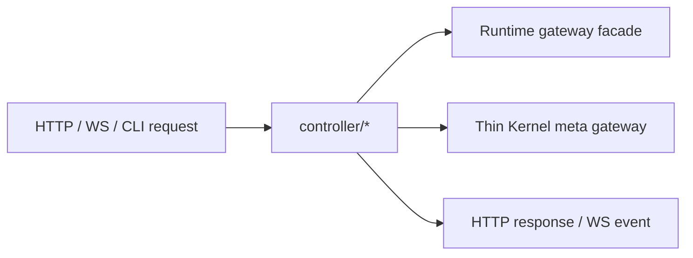

# @zhongmiao/meta-lc-bff

English | [中文文档](./README_zh.md)

## Package Role

`bff` is the NestJS IO Gateway boundary package. It owns HTTP/WS DTOs, protocol controllers, and bootstrap wiring; it must not own runtime, query, mutation, datasource, permission, audit, or meta orchestration.

BFF invokes the Runtime gateway facade for page execution. Runtime performs view lookup, execution context construction, datasource wiring, permission context resolution, audit observation, and `RuntimeExecutor` execution.

`/meta/*` remains a thin read-only Kernel gateway. It returns HTTP envelopes only and does not publish metadata, execute registry migrations, or participate in page execution.

## Source Layout

```text
bff/src/
├── bootstrap/
├── common/
│   └── constants/
├── config/
├── controller/
│   ├── http/
│   ├── ws/
│   │   └── runtime/
│   │       ├── ws.gateway.ts
│   │       ├── broadcast.bus.ts
│   │       ├── health.controller.ts
│   │       ├── operations.state.ts
│   │       └── replay.store.ts
├── infra/
│   ├── cache/
│   └── integration/
└── index.ts
```

## Folder Constraints

- `controller/http/**` is the HTTP API entry layer.
- `controller/ws/**` is the WebSocket entry layer. Runtime WebSocket files must stay under `controller/ws/runtime/**`.
- `infra/cache/**` owns gateway cache only.
- `infra/integration/**` owns thin Kernel metadata registry integration only.
- `config/**` owns gateway protocol configuration only: HTTP/CORS/request-id/timeout, WebSocket path/replay, gateway cache, provider token, and log-level knobs.
- `common/constants/**` owns package-level constants and provider tokens.
- `common/**` owns small framework-level helpers and exception utilities only.
- `bootstrap/**` owns Nest module wiring and process startup.

## Type And Interface Rules

- `*.interface.ts` means behavior contracts or structural abstractions and may only export `interface`.
- `*.type.ts` means data shapes or structural composition and may only export `type`.
- Do not mix `export type` inside `*.interface.ts`.
- Do not mix `export interface` inside `*.type.ts`.
- Do not declare TypeScript `type` or `interface` in controller/service/infra implementation files.
- Do not add `types/index.ts` or `interfaces/index.ts` aggregators.

## Dependency Direction

```text
controller/http -> runtime facade
controller/http -> kernel registry
controller/ws -> runtime WS contracts
```

`bootstrap` wires the module. `common` and `config` may be shared support layers, but they must not import implementation layers back upward.

## Minimal Flow



## Commands

```bash
pnpm --filter @zhongmiao/meta-lc-bff build
pnpm --filter @zhongmiao/meta-lc-bff test
pnpm --filter @zhongmiao/meta-lc-bff start
```

## Boundary Notes

- WebSocket is an entry protocol layer, not infra and not application orchestration.
- Direct DB driver use is forbidden in BFF source and package manifests.
- BFF gateway config must not read DB, datasource, query compiler, permission policy, runtime node execution, or audit persistence settings.
- Runtime UI and kernel source-of-truth logic must not be moved into BFF.
- Runtime datasource, permission, audit, and org-scope wiring must stay inside runtime or the owning packages.
- Do not restore legacy `/query` or `/mutation` endpoints; page data requests must use `POST /view/:name`.
- Do not add `application/**`, `contracts/**`, `domain/**`, `mapper/**`, `infra/repository/**`, or `infra/interfaces/**`; BFF is only a Gateway invoking Runtime and exposing thin Kernel metadata reads.
