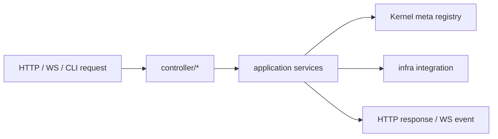

# @zhongmiao/meta-lc-bff

[English](./README.md) | 中文文档

## 包定位

`bff` 是 NestJS Gateway 边界包。它用严格分层隔离协议入口、Runtime 调用、领域模型、基础设施集成、启动逻辑和共享契约；不得承载 query / mutation 编排。

BFF 在调用 Runtime facade 前从 Kernel-backed meta registry 读取 view definition；它不发布元数据，也不执行 registry migration。

## 源码结构

```text
bff/src/
├── controller/
│   ├── http/
│   ├── ws/
│   │   └── runtime/
│   │       ├── ws.gateway.ts
│   │       ├── broadcast.bus.ts
│   │       ├── health.controller.ts
│   │       ├── operations.state.ts
│   │       └── replay.store.ts
│   └── cli/
├── application/
│   ├── services/
│   ├── types/
│   └── interfaces/
├── domain/
│   ├── entities/
│   ├── value-objects/
│   ├── types/
│   └── interfaces/
├── infra/
│   ├── repository/
│   ├── integration/
│   ├── cache/
│   ├── types/
│   └── interfaces/
├── contracts/
│   ├── types/
│   └── interfaces/
├── dto/
├── mapper/
├── constants/
├── common/
├── config/
├── bootstrap/
├── utils/
└── index.ts
```

## 文件夹约束

- `controller/http/**` 是 HTTP API 入口层。
- `controller/ws/**` 是 WebSocket 入口层。Runtime WebSocket 文件必须固定在 `controller/ws/runtime/**`。
- `controller/cli/**` 是 CLI/RPC 入口层。
- `application/**` 只负责应用服务和 runtime invocation，不放传输层 controller，也不承载 query / mutation 编排。
- `domain/**` 放实体、值对象、领域数据形状和领域行为契约。
- `infra/**` 放 repository、integration、cache 等外部依赖实现。
- `contracts/**` 只放跨层共享的请求/响应数据形状和行为契约。
- `dto/**` 只能放 class DTO，禁止声明 `type` 或 `interface`。
- `mapper/**` 负责 protocol DTO、contracts 与 application input 之间的转换。
- `constants/**` 放包级常量和 provider token。
- `config/**` 放环境变量与配置加载。
- `common/**` 只放少量框架级 helper 和异常工具。
- `bootstrap/**` 放 Nest module 装配、进程启动和 migration/bootstrap runner。
- `utils/**` 只保留纯函数工具，必须尽量收敛。

## Type 与 Interface 规则

- `*.interface.ts` = 行为契约/结构抽象，只允许 `export interface`。
- `*.type.ts` = 数据形状/结构组合，只允许 `export type`。
- 禁止在 `*.interface.ts` 中混写 `export type`。
- 禁止在 `*.type.ts` 中混写 `export interface`。
- 禁止在 controller/service/infra implementation 文件中声明 TypeScript `type` 或 `interface`。
- 禁止新增 `types/index.ts` 或 `interfaces/index.ts` 聚合类型入口。

## 依赖方向

```text
controller -> application -> domain -> infra
```

`bootstrap` 只负责装配各层。`common`、`contracts`、`config`、`constants` 是共享支撑层，但不能反向依赖 implementation layer。

## 最小闭环



## 常用命令

```bash
pnpm --filter @zhongmiao/meta-lc-bff build
pnpm --filter @zhongmiao/meta-lc-bff test
pnpm --filter @zhongmiao/meta-lc-bff start
```

## 边界约束

- WebSocket 是入口协议层，不属于 infra，也不承载 application orchestration。
- direct DB driver use 必须保留在允许的 edge files 内，并通过 `pnpm test:boundaries`。
- 不把 runtime UI 或 kernel 的结构真源逻辑搬进 BFF。
- 禁止恢复 `/query`、`/mutation` 旧入口；页面级数据请求必须走 `POST /view/:name`。
- 禁止新增 `application/orchestrator/**`；BFF 只能作为 Gateway 调用 Runtime。
