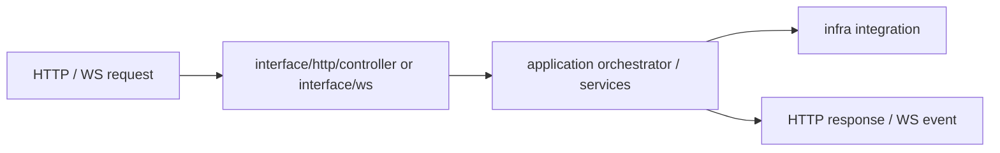

# @zhongmiao/meta-lc-bff

[English](./README.md) | 中文文档

## 包定位

`bff` 是 NestJS 边界包。它把应用编排、HTTP/WS 入口、基础设施集成、启动逻辑与通用工具明确分层。

## 源码结构

```text
bff/src/
├── application/
│   ├── orchestrator/
│   │   ├── aggregation.orchestrator.ts
│   │   ├── mutation.orchestrator.ts
│   │   ├── query.orchestrator.ts
│   │   └── query-pipeline.orchestrator.ts
│   ├── services/
│   │   └── meta-registry.service.ts
│   └── index.ts
├── interface/
│   ├── http/
│   │   └── controller/
│   │       ├── meta.controller.ts
│   │       ├── query.controller.ts
│   │       └── view.controller.ts
│   ├── ws/
│   │   ├── runtime-ws-broadcast.bus.ts
│   │   ├── runtime-ws-health.controller.ts
│   │   ├── runtime-ws-operations.state.ts
│   │   ├── runtime-ws-replay.store.ts
│   │   └── ws.gateway.ts
│   ├── contracts/
│   │   ├── meta-registry.contract.ts
│   │   └── view.contract.ts
│   ├── protocols/
│   │   ├── meta.http.ts
│   │   └── view.http.ts
│   └── index.ts
├── infra/
│   ├── cache/
│   ├── integration/
│   │   ├── audit.service.ts
│   │   ├── org-scope.service.ts
│   │   └── postgres-query.service.ts
│   └── index.ts
├── bootstrap/
│   ├── app.module.ts
│   ├── bootstrap.service.ts
│   ├── cli.ts
│   ├── main.ts
│   └── migration-runner.ts
├── common/
├── types/
├── utils/
└── index.ts
```

## 核心职责

- 接收 HTTP query、mutation、health、meta、view request。
- 将编排保留在 `application`，尤其是 query/mutation 与 view 编译执行。
- 将 HTTP 和 WS 入口保留在 `interface`。
- 将 Postgres 与外部依赖保留在 `infra`。
- 将启动与 bootstrap 逻辑隔离在 `bootstrap`。
- 在配置允许时为 dev/test 环境 bootstrap meta、business、audit database baseline。

## 与其他包关系

- 使用 `contracts` 与 `protocols` 描述请求/响应形状与传输层 DTO。
- 使用 `query` 与 `permission` 完成服务端 query 与 access decision。
- 在受允许的 BFF edge files 中使用 shared helper 与直接 Postgres integration。
- 随着 meta API 成熟，应编排接入 `kernel` 完成 metadata versioning 与 migration orchestration。
- `apps/bff-server` 是基于本包构建的可运行进程入口。

## 最小闭环



## 常用命令

```bash
pnpm --filter @zhongmiao/meta-lc-bff build
pnpm --filter @zhongmiao/meta-lc-bff test
pnpm --filter @zhongmiao/meta-lc-bff start
```

## 边界约束

- `interface` 是唯一入口层。
- direct DB driver use 必须保留在允许的 edge files 内，并通过 boundary check。
- 不把 runtime UI 或 kernel 的结构真源逻辑搬进 BFF。
