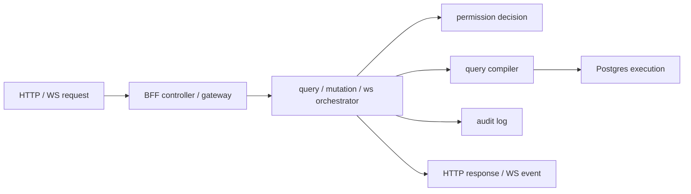

# @zhongmiao/meta-lc-bff

[English](./README.md) | 中文文档

## 包定位

`bff` 是 NestJS middleware 编排包。它暴露 BFF module、query/mutation controller、meta gateway、cache、audit integration、Postgres execution integration、organization-scope integration 与 runtime websocket gateway。

## 核心职责

- 接收 HTTP query、mutation、health、meta request。
- 编排 query compilation、permission decision、datasource execution、audit logging、cache 与 response shaping。
- 协调 mutation execution 与 audit outcome。
- 提供 runtime websocket event、replay 与 health 支持。
- 在配置允许时为 dev/test 环境 bootstrap meta、business、audit database baseline。

## 与其他包关系

- 使用 `contracts` 作为 API request/response 形状。
- 使用 `query` 与 `permission` 完成服务端 query 与 access decision。
- 在受允许的 BFF edge files 中使用 shared helper 与直接 Postgres integration。
- 随着 meta API 成熟，应编排接入 `kernel` 完成 metadata versioning 与 migration orchestration。
- `apps/bff-server` 是基于本包构建的可运行进程入口。

## 最小闭环



## 常用命令

```bash
pnpm --filter @zhongmiao/meta-lc-bff build
pnpm --filter @zhongmiao/meta-lc-bff test
pnpm --filter @zhongmiao/meta-lc-bff start
```

## 边界约束

- BFF 是 frontend 与 runtime 数据访问的 integration boundary。
- direct DB driver use 必须保留在允许的 edge files 内，并通过 boundary check。
- 不把 runtime UI 或 kernel 的结构真源逻辑搬进 BFF。
