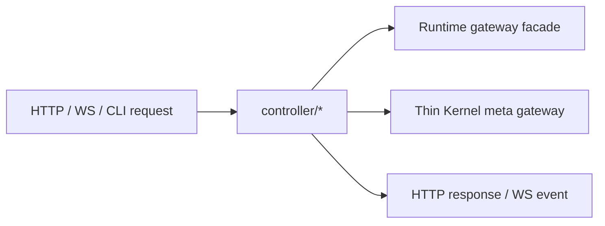

# @zhongmiao/meta-lc-bff

[English](./README.md) | 中文文档

## 包定位

`bff` 是 NestJS IO Gateway 边界包。它只拥有 HTTP/WS DTO、协议 controller 和 bootstrap wiring；不得承载 runtime、query、mutation、datasource、permission、audit 或 meta 编排。

BFF 对页面执行只调用 Runtime gateway facade。Runtime 负责 view lookup、execution context 构建、datasource wiring、permission context resolution、audit observation 与 `RuntimeExecutor` 执行。

`/meta/*` 保留为只读的 thin Kernel gateway。它只返回 HTTP envelope，不发布 metadata、不执行 registry migration，也不参与页面执行。

## 源码结构

```text
bff/src/
├── bootstrap/
├── common/
│   └── constants/
├── config/
├── controller/
│   ├── http/
│   ├── ws/
│   │   └── runtime/
│   │       ├── ws.gateway.ts
│   │       ├── broadcast.bus.ts
│   │       ├── health.controller.ts
│   │       ├── operations.state.ts
│   │       └── replay.store.ts
├── infra/
│   ├── cache/
│   └── integration/
└── index.ts
```

## 文件夹约束

- `controller/http/**` 是 HTTP API 入口层。
- `controller/ws/**` 是 WebSocket 入口层。Runtime WebSocket 文件必须固定在 `controller/ws/runtime/**`。
- `infra/cache/**` 只放 gateway cache。
- `infra/integration/**` 只放 thin Kernel metadata registry integration。
- `config/**` 只放 gateway 协议层配置：HTTP/CORS/request-id/timeout、WebSocket path/replay、gateway cache、provider token 与 log level。
- `common/constants/**` 放包级常量和 provider token。
- `common/**` 只放少量框架级 helper 和异常工具。
- `bootstrap/**` 放 Nest module 装配与进程启动。

## Type 与 Interface 规则

- `*.interface.ts` = 行为契约/结构抽象，只允许 `export interface`。
- `*.type.ts` = 数据形状/结构组合，只允许 `export type`。
- 禁止在 `*.interface.ts` 中混写 `export type`。
- 禁止在 `*.type.ts` 中混写 `export interface`。
- 禁止在 controller/service/infra implementation 文件中声明 TypeScript `type` 或 `interface`。
- 禁止新增 `types/index.ts` 或 `interfaces/index.ts` 聚合类型入口。

## 依赖方向

- 上游：`apps/bff-server` 与 client 协议入口。
- 下游：`runtime` 负责页面执行，`kernel` 负责 thin metadata reads。

```text
controller/http -> runtime facade
controller/http -> kernel registry
controller/ws -> runtime WS contracts
```

`bootstrap` 只负责装配模块。`common` 与 `config` 是共享支撑层，但不能反向依赖 implementation layer。

## 最小闭环



## 常用命令

```bash
pnpm --filter @zhongmiao/meta-lc-bff build
pnpm --filter @zhongmiao/meta-lc-bff test
pnpm --filter @zhongmiao/meta-lc-bff start
```

## 边界约束

- WebSocket 是入口协议层，不属于 infra，也不承载 application orchestration。
- BFF source 和 package manifest 禁止 direct DB driver use。
- BFF gateway config 禁止读取 DB、datasource、query compiler、permission policy、runtime node execution 或 audit persistence 配置。
- 不把 runtime UI 或 kernel 的结构真源逻辑搬进 BFF。
- Runtime datasource、permission、audit 与 org-scope wiring 必须留在 runtime 或所属包内。
- 禁止恢复 `/query`、`/mutation` 旧入口；页面级数据请求必须走 `POST /view/:name`。
- 禁止新增 `application/**`、`contracts/**`、`domain/**`、`mapper/**`、`infra/repository/**` 或 `infra/interfaces/**`；BFF 只能作为 Gateway 调用 Runtime 并暴露 thin Kernel metadata reads。
