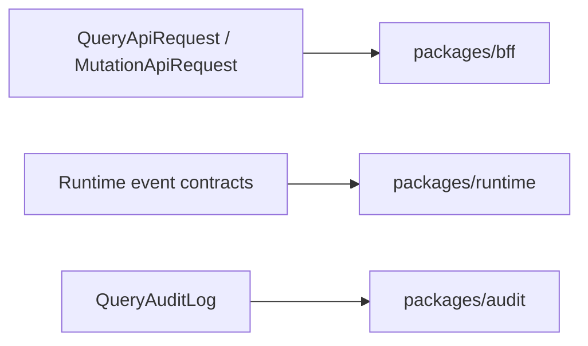

# @zhongmiao/meta-lc-contracts

English | [中文文档](./README_zh.md)

## Package Role

`contracts` defines cross-package DTOs and protocol contracts for query, mutation, permission scope, audit, runtime page topics, runtime events, nodes, datasources, actions, and rules.

## Responsibilities

- Keep request and response shapes shared by BFF, audit, runtime, and consumers.
- Provide stable helper constructors for runtime manager executed events.
- Avoid runtime dependencies so contracts can remain a low-level package.

## Relationship With Other Packages

- Used by `bff` for HTTP request and response contracts.
- Used by `audit` for `QueryAuditLog`.
- Used by `runtime` for runtime event and DSL-facing shapes.
- Referenced by `platform` as part of the aggregate package identity.

## Minimal Flow



## Commands

```bash
pnpm --filter @zhongmiao/meta-lc-contracts build
pnpm --filter @zhongmiao/meta-lc-contracts test
```

## Boundary Notes

- Do not add service, database, or framework logic here.
- Keep exported types broad enough for package boundaries but specific enough for contract tests.
