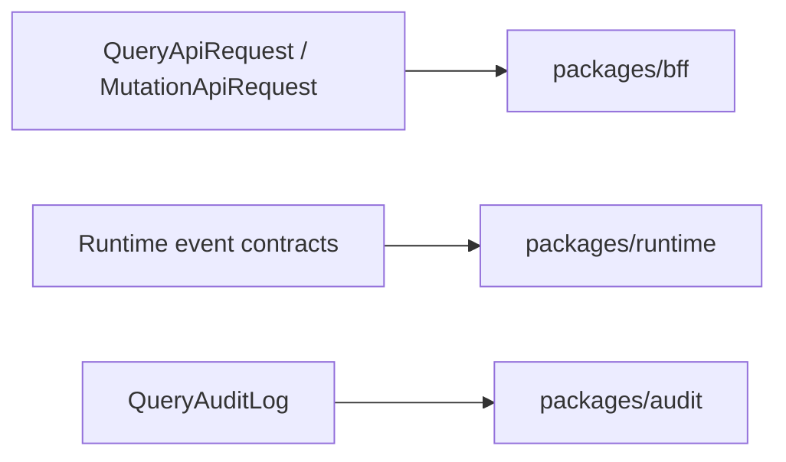

# @zhongmiao/meta-lc-contracts

[English](./README.md) | 中文文档

## 包定位

`contracts` 定义跨包 DTO 与协议 contract，包括 query、mutation、permission scope、audit、runtime page topic、runtime event、node、datasource、action、rule 等形状。

## 核心职责

- 统一 BFF、audit、runtime 与消费方共享的 request/response 结构。
- 提供 runtime manager executed event 的稳定构造函数。
- 避免运行时依赖，让 contracts 保持底层包属性。

## 与其他包关系

- `bff` 使用它作为 HTTP request/response contract。
- `audit` 使用其中的 `QueryAuditLog`。
- `runtime` 使用 runtime event 与 DSL 相关类型。
- `platform` 把它纳入聚合包身份。

## 最小闭环



## 常用命令

```bash
pnpm --filter @zhongmiao/meta-lc-contracts build
pnpm --filter @zhongmiao/meta-lc-contracts test
```

## 边界约束

- 不在这里加入 service、database 或 framework 逻辑。
- 导出的类型需要服务包边界，同时由 contract tests 约束。
