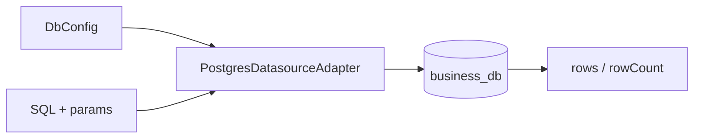

# @zhongmiao/meta-lc-datasource

English | [中文文档](./README_zh.md)

## Package Role

`datasource` owns database adapter concerns. The current implementation focuses on Postgres configuration and a Postgres datasource adapter.

## Responsibilities

- Define datasource and DB configuration types.
- Create Postgres clients from environment-backed configuration.
- Execute SQL through the adapter boundary.

## Relationship With Other Packages

- `bff` uses datasource-style execution for query and mutation integration.
- `query` produces SQL that a datasource adapter can execute.
- `permission` affects the constraints included before execution.
- `kernel` remains separate; metadata versioning is not owned by this package.

## Minimal Flow



## Commands

```bash
pnpm --filter @zhongmiao/meta-lc-datasource build
pnpm --filter @zhongmiao/meta-lc-datasource test
```

## Boundary Notes

- Keep adapter code focused on database execution and lifecycle.
- Do not add HTTP controller or runtime orchestration here.
