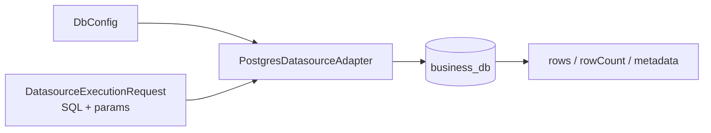

# @zhongmiao/meta-lc-datasource

English | [中文文档](./README_zh.md)

## Package Role

`datasource` owns physical data execution adapters. The current implementation focuses on a stable datasource execution contract and a Postgres adapter.

## Responsibilities

- Define datasource and DB configuration types.
- Create Postgres clients from environment-backed configuration.
- Execute compiled SQL through the adapter boundary and normalize rows, row counts, metadata, and errors.

## Relationship With Other Packages

- `runtime` consumes datasource adapters through a stable execution contract.
- `bff` wires the concrete Postgres adapter into runtime view execution.
- `query` produces SQL that a datasource adapter can execute.
- `permission` affects the constraints included before execution.
- `kernel` remains separate; metadata versioning is not owned by this package.

## Minimal Flow



## Commands

```bash
pnpm --filter @zhongmiao/meta-lc-datasource build
pnpm --filter @zhongmiao/meta-lc-datasource test
```

## Boundary Notes

- Keep adapter code focused on database execution and lifecycle.
- Do not add HTTP controller or runtime orchestration here.
- Do not read BFF-specific request objects here.
