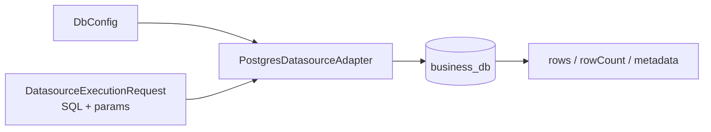

# @zhongmiao/meta-lc-datasource

English | [中文文档](./README_zh.md)

## Package Role

`datasource` owns stable physical data execution contracts at the package root. Concrete Postgres adapters are exposed through the explicit secondary entry `@zhongmiao/meta-lc-datasource/postgres`.

## Responsibilities

- Define datasource and DB configuration types.
- Expose Postgres clients from the `/postgres` secondary entry.
- Execute compiled SQL through the adapter boundary and normalize rows, row counts, metadata, and errors.

## Relationship With Other Packages

- Upstream: `runtime`.
- Downstream: `business_db`; datasource has no workspace package dependencies.
- `runtime` consumes datasource adapters through the stable root execution contract.
- Composition roots wire concrete Postgres adapters through `@zhongmiao/meta-lc-datasource/postgres`; BFF does not depend on this package.
- `query` produces SQL that a datasource adapter can execute.
- `permission` affects the constraints included before execution.
- `kernel` remains separate; metadata versioning is not owned by this package.
- `PostgresOrgScopeAdapter` is a platform data-scope adapter used by runtime permission context assembly.
- Orders-specific demo mutation logic lives in `examples/orders-demo` only.
- Core datasource only keeps generic Postgres execution and platform adapter edges such as org-scope loading.
- Package root exports contracts only; Postgres implementation is not exposed from root.

## Minimal Flow



## Commands

```bash
pnpm --filter @zhongmiao/meta-lc-datasource build
pnpm --filter @zhongmiao/meta-lc-datasource test
```

## Postgres Secondary Entry

The package root is contract-only and does not force Postgres driver installation. Consumers that import `@zhongmiao/meta-lc-datasource/postgres` must install a compatible `pg` version in their composition root.

```ts
import {
  PostgresDatasourceAdapterFactory,
  createPostgresDatasourceAdapter
} from "@zhongmiao/meta-lc-datasource/postgres";

const adapter = createPostgresDatasourceAdapter(config);
const adapterFromClassFactory = new PostgresDatasourceAdapterFactory().create(config);
```

Prefer the function or class factory from composition roots. The Postgres adapter class remains exported for advanced tests and low-level integration, but application wiring should use factories.

## Boundary Notes

- Keep adapter code focused on database execution and lifecycle.
- Import Postgres implementation from `@zhongmiao/meta-lc-datasource/postgres`, not the package root.
- Receives compiled request / SQL command.
- Must not compile Query AST.
- Must not depend on query / permission / runtime.
- Business demo adapters must live under `examples/*`, not in this package.
- Keep platform adapters generic; business semantics must not become implicit datasource orchestration.
- Do not add HTTP controller or runtime orchestration here.
- Do not read BFF-specific request objects here.
