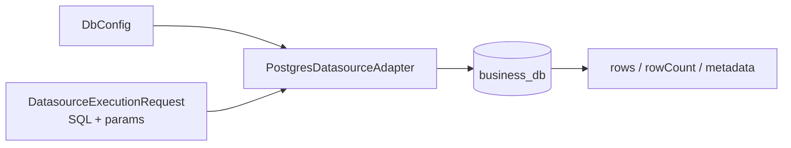

# @zhongmiao/meta-lc-datasource

[English](./README.md) | 中文文档

## 包定位

`datasource` 在包根入口只承担稳定的物理数据执行 contract。具体 Postgres adapter 通过显式 secondary entry `@zhongmiao/meta-lc-datasource/postgres` 暴露。

## 核心职责

- 定义 datasource 与 DB configuration 类型。
- 通过 `/postgres` secondary entry 暴露 Postgres client。
- 通过 adapter 边界执行编译后的 SQL，并归一化 rows、rowCount、metadata 与 error。

## 与其他包关系

- 上游：`runtime`。
- 下游：`business_db`；datasource 不依赖任何 workspace package。
- `runtime` 通过包根的稳定 execution contract 消费 datasource adapter。
- Composition root 通过 `@zhongmiao/meta-lc-datasource/postgres` 装配具体 Postgres adapter；BFF 不依赖本包。
- `query` 生成 datasource adapter 可执行的 SQL。
- `permission` 影响执行前加入的约束。
- `kernel` 保持独立；metadata versioning 不属于本包职责。
- `PostgresOrgScopeAdapter` 是 runtime permission context 装配使用的平台 data-scope adapter。
- orders 专用 demo mutation 逻辑只放在 `examples/orders-demo`。
- 核心 datasource 只保留 generic Postgres execution 与 org-scope loading 等平台 adapter 边界。
- 包根入口只导出 contract；Postgres implementation 不从 root 暴露。

## 最小闭环



## 常用命令

```bash
pnpm --filter @zhongmiao/meta-lc-datasource build
pnpm --filter @zhongmiao/meta-lc-datasource test
```

## Postgres Secondary Entry

包根入口只暴露 contract，不强制安装 Postgres driver。消费者只有在导入 `@zhongmiao/meta-lc-datasource/postgres` 时，才需要在 composition root 中安装兼容版本的 `pg`。

```ts
import {
  PostgresDatasourceAdapterFactory,
  createPostgresDatasourceAdapter
} from "@zhongmiao/meta-lc-datasource/postgres";

const adapter = createPostgresDatasourceAdapter(config);
const adapterFromClassFactory = new PostgresDatasourceAdapterFactory().create(config);
```

Factory-first 规则：composition root 应使用 `createPostgresDatasourceAdapter` 或 `PostgresDatasourceAdapterFactory`。`PostgresDatasourceAdapter` 仍作为 advanced API 导出，供低层集成和包内测试使用，但应用装配不得直接 `new PostgresDatasourceAdapter()`。

## 边界约束

- adapter 代码只关注数据库执行与生命周期。
- Postgres implementation 必须从 `@zhongmiao/meta-lc-datasource/postgres` 导入，而不是包根。
- 应用代码不得 deep import `src/postgres/*`。
- 接收 compiled request 或 SQL command；不在此包编译 Query AST。
- 不依赖 `query`、`permission` 或 `runtime`。
- 业务 demo adapter 必须放在 `examples/*`，不能进入本包。
- 平台 adapter 必须保持通用；业务语义不能隐式滑向 datasource 编排。
- 不在这里加入 HTTP controller 或 runtime orchestration。
- 不在这里读取 BFF 专用 request object。
