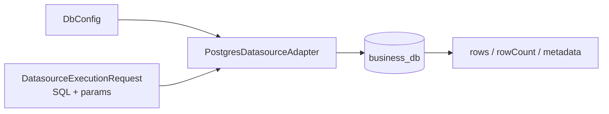

# @zhongmiao/meta-lc-datasource

[English](./README.md) | 中文文档

## 包定位

`datasource` 承担物理数据执行 adapter 边界。当前实现聚焦稳定 datasource execution 契约与 Postgres adapter。

## 核心职责

- 定义 datasource 与 DB configuration 类型。
- 基于环境配置创建 Postgres client。
- 通过 adapter 边界执行编译后的 SQL，并归一化 rows、rowCount、metadata 与 error。

## 与其他包关系

- `runtime` 通过稳定 execution contract 消费 datasource adapter。
- Runtime 为页面执行装配具体 Postgres adapter；BFF 不依赖本包。
- `query` 生成 datasource adapter 可执行的 SQL。
- `permission` 影响执行前加入的约束。
- `kernel` 保持独立；metadata versioning 不属于本包职责。

## 最小闭环



## 常用命令

```bash
pnpm --filter @zhongmiao/meta-lc-datasource build
pnpm --filter @zhongmiao/meta-lc-datasource test
```

## 边界约束

- adapter 代码只关注数据库执行与生命周期。
- demo business mutation 与 org-scope 读取属于这里的 Postgres adapter，不属于 BFF。
- 不在这里加入 HTTP controller 或 runtime orchestration。
- 不在这里读取 BFF 专用 request object。
