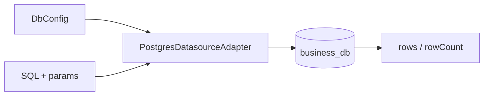

# @zhongmiao/meta-lc-datasource

[English](./README.md) | 中文文档

## 包定位

`datasource` 承担数据库 adapter 边界。当前实现聚焦 Postgres 配置与 Postgres datasource adapter。

## 核心职责

- 定义 datasource 与 DB configuration 类型。
- 基于环境配置创建 Postgres client。
- 通过 adapter 边界执行 SQL。

## 与其他包关系

- `bff` 在 query 与 mutation integration 中使用 datasource 风格的执行能力。
- `query` 生成 datasource adapter 可执行的 SQL。
- `permission` 影响执行前加入的约束。
- `kernel` 保持独立；metadata versioning 不属于本包职责。

## 最小闭环



## 常用命令

```bash
pnpm --filter @zhongmiao/meta-lc-datasource build
pnpm --filter @zhongmiao/meta-lc-datasource test
```

## 边界约束

- adapter 代码只关注数据库执行与生命周期。
- 不在这里加入 HTTP controller 或 runtime orchestration。
