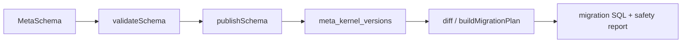

# @zhongmiao/meta-lc-kernel

English | [中文文档](./README_zh.md)

## Package Role

`kernel` is the structural metadata source for the platform. It owns MetaSchema types, schema validation, snapshot and migration DSL helpers, schema diff, SQL generation, API route manifest generation, permission manifest generation, version publishing, rollback, and migration audit persistence.

## Responsibilities

- Define table, field, relation, index, tenant, app, rule, and permission schema types.
- Validate schemas before they are published.
- Persist and retrieve versioned schemas through the Postgres repository.
- Generate schema SQL, migration SQL, API route manifests, and permission manifests.
- Guard destructive migration statements and record migration audits.

## Relationship With Other Packages

- `migration` reuses kernel migration compile and safety helpers.
- `bff` should compose kernel services for meta APIs and migration orchestration.
- `query`, `permission`, and `datasource` must not become kernel dependencies.
- `platform` may expose kernel-facing capabilities through package composition later, but the runnable BFF remains separate.

## Minimal Flow



## Commands

```bash
pnpm --filter @zhongmiao/meta-lc-kernel build
pnpm --filter @zhongmiao/meta-lc-kernel test
```

## Boundary Notes

- Kernel is the metadata source of truth and must stay independent from BFF orchestration.
- DB access here is limited to meta-kernel persistence and migration audit responsibilities.
- Do not add HTTP, NestJS controller, runtime UI, or business execution logic here.
