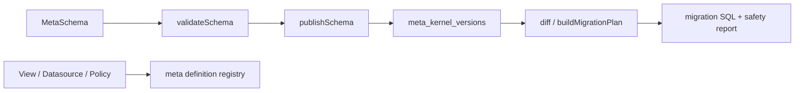

# @zhongmiao/meta-lc-kernel

English | [中文文档](./README_zh.md)

## Package Role

`kernel` is the structural metadata source for the platform. It owns MetaSchema, ViewDefinition, NodeDefinition, DatasourceDefinition, PermissionPolicy, schema validation, snapshot and migration DSL helpers, schema diff, SQL generation, version publishing, rollback, repository contracts, and the versioned meta definition registry.

## Responsibilities

- Define table, field, relation, index, tenant, app, rule, and permission schema types.
- Validate schemas before they are published.
- Persist and retrieve versioned schemas through the repository port; concrete Postgres persistence lives in `@zhongmiao/meta-lc-kernel-adapter-postgres`.
- Publish, retrieve, and diff versioned view, datasource, and permission policy definitions.
- Generate schema SQL, migration SQL, API route manifests, and permission manifests.
- Guard destructive migration statements and record migration audits.

## Relationship With Other Packages

- Upstream: `bff`, `runtime`, and `infra/scripts`.
- Downstream: repository implementations; kernel has no workspace package dependencies.
- Migration lifecycle scripts reuse kernel migration compile and safety helpers from infra.
- `bff` reads kernel registry definitions as a thin gateway and must not orchestrate metadata.
- `query`, `permission`, `datasource`, `runtime`, `audit`, and `bff` must not become kernel dependencies.
- Kernel owns structure contracts; runtime consumes view/node definitions and owns only execution contracts.
- `PermissionPolicy.scope` is a local structural literal; permission runtime data-scope DTOs live in `permission` and only share string semantics with kernel.

## Minimal Flow



## Commands

```bash
pnpm --filter @zhongmiao/meta-lc-kernel build
pnpm --filter @zhongmiao/meta-lc-kernel test
```

## Boundary Notes

- Kernel is the metadata source of truth and must stay independent from BFF orchestration.
- The package root exposes `core` contracts and `application` APIs only; `domain` remains an internal semantic layer, not SDK public API.
- Kernel has no workspace package dependencies and no direct Postgres access.
- Meta DB persistence is provided by repository ports and external adapters such as `@zhongmiao/meta-lc-kernel-adapter-postgres`.
- Do not add HTTP, NestJS controller, runtime UI, or business execution logic here.
- Do not execute runtime plans from meta registry APIs; registry only versions definitions.
- Do not keep business demo registry seeds here; examples own their own seed metadata under `examples/*`.
