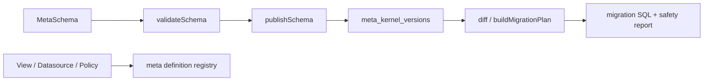

# @zhongmiao/meta-lc-kernel

[English](./README.md) | 中文文档

## 包定位

`kernel` 是平台结构元数据来源。它拥有 MetaSchema、ViewDefinition、NodeDefinition、DatasourceDefinition、PermissionPolicy、schema 校验、snapshot/migration DSL helper、schema diff、SQL 生成、版本发布、回滚、repository contract，以及版本化 meta definition registry。

## 核心职责

- 定义 table、field、relation、index、tenant、app、rule、permission schema 类型。
- 在发布前校验 schema。
- 通过 repository port 持久化和读取版本化 schema；具体 Postgres 持久化实现位于 `@zhongmiao/meta-lc-kernel-adapter-postgres`。
- 发布、读取和 diff 版本化 view、datasource 与 permission policy definition。
- 生成 schema SQL、migration SQL、API route manifest 与 permission manifest。
- 拦截破坏性 migration statement，并记录 migration audit。

## 与其他包关系

- 上游：`bff`、`runtime` 与 `infra/scripts`。
- 下游：repository implementation；kernel 不依赖任何 workspace package。
- Migration lifecycle scripts 在 infra 中复用 kernel 的 migration compile 与 safety helper。
- `bff` 只能作为 thin gateway 读取 kernel registry definition，不承载 metadata orchestration。
- `query`、`permission`、`datasource`、`runtime`、`audit`、`bff` 不能成为 kernel 依赖。
- Kernel 拥有结构契约；runtime 消费 view/node definition，只拥有执行契约。
- `PermissionPolicy.scope` 是 kernel 本地结构字面量；permission 的 runtime data-scope DTO 留在 `permission`，两边只共享字符串语义。

## 最小闭环



## 常用命令

```bash
pnpm --filter @zhongmiao/meta-lc-kernel build
pnpm --filter @zhongmiao/meta-lc-kernel test
```

## 边界约束

- Kernel 是元数据结构真源，必须独立于 BFF 编排。
- 包根入口只暴露 `core` contract 与 `application` API；`domain` 是内部语义层，不作为 SDK public API。
- Kernel 不依赖任何 workspace package，也不直接访问 Postgres。
- Meta DB persistence 由 repository port 和外部 adapter 提供，例如 `@zhongmiao/meta-lc-kernel-adapter-postgres`。
- 不在这里加入 HTTP、NestJS controller、runtime UI 或业务执行逻辑。
- meta registry API 不执行 runtime plan；只负责 definition versioning。
- 不在这里保留业务 demo registry seed；examples 在 `examples/*` 下拥有自己的 seed metadata。
