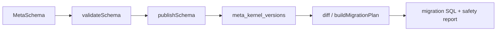

# @zhongmiao/meta-lc-kernel

[English](./README.md) | 中文文档

## 包定位

`kernel` 是平台结构元数据来源。它负责 MetaSchema 类型、schema 校验、snapshot/migration DSL helper、schema diff、SQL 生成、API route manifest 生成、permission manifest 生成、版本发布、回滚与 migration audit 持久化。

## 核心职责

- 定义 table、field、relation、index、tenant、app、rule、permission schema 类型。
- 在发布前校验 schema。
- 通过 Postgres repository 持久化和读取版本化 schema。
- 生成 schema SQL、migration SQL、API route manifest 与 permission manifest。
- 拦截破坏性 migration statement，并记录 migration audit。

## 与其他包关系

- `migration` 复用 kernel 的 migration compile 与 safety helper。
- `bff` 应通过编排接入 kernel service，承载 meta API 与 migration orchestration。
- `query`、`permission`、`datasource` 不能成为 kernel 依赖。
- `platform` 后续可聚合 kernel 能力，但可运行 BFF 仍保持独立。

## 最小闭环



## 常用命令

```bash
pnpm --filter @zhongmiao/meta-lc-kernel build
pnpm --filter @zhongmiao/meta-lc-kernel test
```

## 边界约束

- Kernel 是元数据结构真源，必须独立于 BFF 编排。
- 这里的 DB access 仅服务 meta-kernel persistence 与 migration audit。
- 不在这里加入 HTTP、NestJS controller、runtime UI 或业务执行逻辑。
