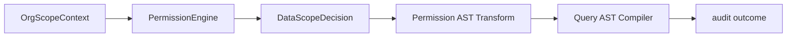

# @zhongmiao/meta-lc-permission

English | [中文文档](./README_zh.md)

## Package Role

`permission` evaluates role and organization data-scope policies and transforms query AST before SQL compilation. It does not inject SQL strings or execute datasources.

## Responsibilities

- Model role data policies and organization scope context.
- Resolve data scopes such as `SELF`, `DEPT`, `DEPT_AND_CHILDREN`, `CUSTOM_ORG_SET`, and `TENANT_ALL`.
- Return decisions with allowed organization ids, fallback flags, and reason text.
- Transform `SelectQueryAst` with tenant, self, and org-scope predicates before the query compiler renders SQL.

## Relationship With Other Packages

- Upstream: `runtime`.
- Downstream: `query` types or AST structures when needed.
- Runtime supplies user/org/policy context for permission transforms during execution.
- `runtime` calls the permission transform before invoking the query compiler.
- `query` compiles permission-transformed AST into SQL and params.
- `permission` owns shared data-scope DTOs used at API boundaries.
- `audit` can record allow/deny outcomes when runtime emits observability events.

## Minimal Flow



## Commands

```bash
pnpm --filter @zhongmiao/meta-lc-permission build
pnpm --filter @zhongmiao/meta-lc-permission test
```

## Boundary Notes

- Keep policy evaluation deterministic.
- Do not fetch users, roles, or organization data directly from this package; runtime supplies context through execution dependencies.
- Do not concatenate SQL clauses here; permissions must flow through AST predicates.
- Must not compile SQL.
- Must not execute datasource.
