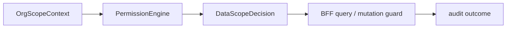

# @zhongmiao/meta-lc-permission

English | [中文文档](./README_zh.md)

## Package Role

`permission` evaluates role and organization data-scope policies. It produces permission decisions that BFF and query orchestration can use to restrict data access.

## Responsibilities

- Model role data policies and organization scope context.
- Resolve data scopes such as `SELF`, `DEPT`, `DEPT_AND_CHILDREN`, `CUSTOM_ORG_SET`, and `TENANT_ALL`.
- Return decisions with allowed organization ids, fallback flags, and reason text.

## Relationship With Other Packages

- `bff` loads user/org/policy context and calls permission evaluation.
- `query` consumes the resulting constraints through BFF orchestration.
- `contracts` contains shared data-scope DTOs used at API boundaries.
- `audit` can record allow/deny outcomes through BFF integration.

## Minimal Flow



## Commands

```bash
pnpm --filter @zhongmiao/meta-lc-permission build
pnpm --filter @zhongmiao/meta-lc-permission test
```

## Boundary Notes

- Keep policy evaluation deterministic.
- Do not fetch users, roles, or organization data directly from this package; BFF integration supplies context.
