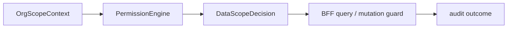

# @zhongmiao/meta-lc-permission

[English](./README.md) | 中文文档

## 包定位

`permission` 负责评估角色与组织数据域策略，产出 BFF 与 query orchestration 可用于限制数据访问的 permission decision。

## 核心职责

- 建模 role data policy 与 organization scope context。
- 解析 `SELF`、`DEPT`、`DEPT_AND_CHILDREN`、`CUSTOM_ORG_SET`、`TENANT_ALL` 等数据域。
- 返回 allowed organization ids、fallback flags 与 reason text。

## 与其他包关系

- `bff` 加载 user/org/policy context 后调用 permission evaluation。
- `query` 通过 BFF 编排消费权限约束。
- `contracts` 包含 API 边界共享的数据域 DTO。
- `audit` 可通过 BFF integration 记录 allow/deny 结果。

## 最小闭环



## 常用命令

```bash
pnpm --filter @zhongmiao/meta-lc-permission build
pnpm --filter @zhongmiao/meta-lc-permission test
```

## 边界约束

- 保持 policy evaluation 确定性。
- 不在此包中直接读取 users、roles 或 organization data；上下文由 BFF integration 提供。
