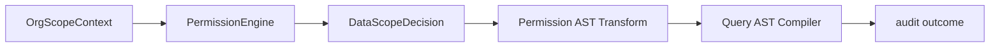

# @zhongmiao/meta-lc-permission

[English](./README.md) | 中文文档

## 包定位

`permission` 负责评估角色与组织数据域策略，并在 SQL 编译前转换 query AST。它不拼接 SQL 字符串，也不执行 datasource。

## 核心职责

- 建模 role data policy 与 organization scope context。
- 解析 `SELF`、`DEPT`、`DEPT_AND_CHILDREN`、`CUSTOM_ORG_SET`、`TENANT_ALL` 等数据域。
- 返回 allowed organization ids、fallback flags 与 reason text。
- 在 query compiler 渲染 SQL 前，为 `SelectQueryAst` 加入 tenant、self 与 org-scope predicates。

## 与其他包关系

- 上游：`runtime`。
- 下游：按需消费 `query` types 或 AST structures。
- Runtime 在执行期为 permission transform 提供 user/org/policy context。
- `runtime` 在调用 query compiler 前执行 permission transform。
- `query` 将 permission-transformed AST 编译为 SQL 与 params。
- `permission` 直接拥有 API 边界共享的数据域 DTO。
- `audit` 可在 runtime 发出 observability event 时记录 allow/deny 结果。

## 最小闭环



## 常用命令

```bash
pnpm --filter @zhongmiao/meta-lc-permission build
pnpm --filter @zhongmiao/meta-lc-permission test
```

## 边界约束

- 保持 policy evaluation 确定性。
- 不在此包中直接读取 users、roles 或 organization data；上下文由 runtime execution dependency 提供。
- 不在此包拼接 SQL clause；权限必须通过 AST predicate 流转。
- 不在此包编译 SQL。
- 不在此包执行 datasource 请求。
