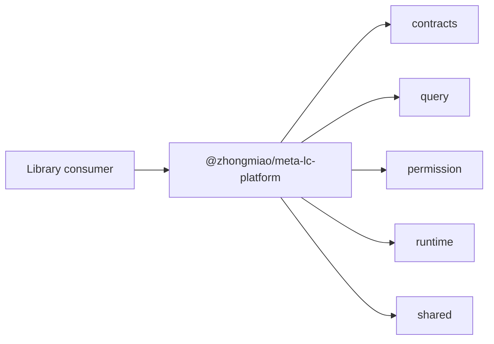

# @zhongmiao/meta-lc-platform

English | [中文文档](./README_zh.md)

## Package Role

`platform` is the aggregate package identity for platform library consumers. It groups public platform package dependencies but does not package the runnable BFF server.

## Responsibilities

- Provide the aggregate `@zhongmiao/meta-lc-platform` package name.
- Keep aggregate dependency declarations aligned with library-facing packages.
- Build a minimal package entry through `scripts/build.mjs`.

## Relationship With Other Packages

- Depends on `contracts`, `query`, `permission`, `runtime`, and `shared`.
- Does not include `bff`, `datasource`, `kernel`, `migration`, or `audit` as runnable service internals.
- `apps/bff-server` remains the process entry for middleware runtime.

## Minimal Flow



## Commands

```bash
pnpm --filter @zhongmiao/meta-lc-platform build
pnpm --filter @zhongmiao/meta-lc-platform test
```

## Boundary Notes

- This package is an aggregate entry, not a NestJS application.
- Do not add server startup, DB connection, or deployment concerns here.
