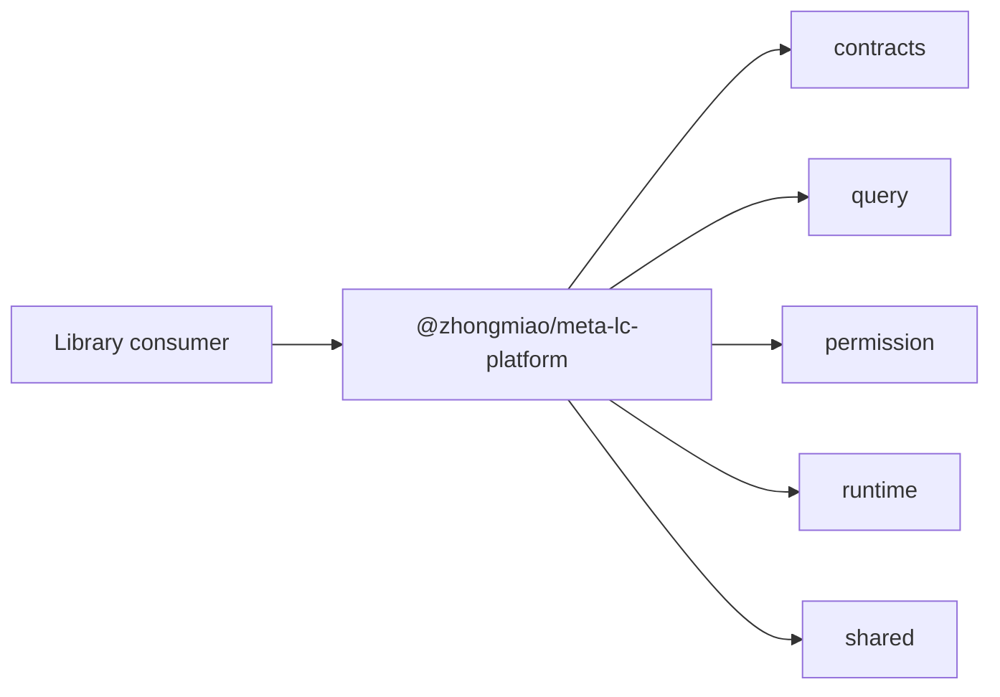

# @zhongmiao/meta-lc-platform

[English](./README.md) | 中文文档

## 包定位

`platform` 是面向平台库消费者的聚合包身份。它聚合 public platform package dependencies，但不打包可运行 BFF server。

## 核心职责

- 提供 `@zhongmiao/meta-lc-platform` 聚合包名。
- 保持聚合依赖声明与 library-facing packages 对齐。
- 通过 `scripts/build.mjs` 构建最小 package entry。

## 与其他包关系

- 依赖 `contracts`、`query`、`permission`、`runtime`、`shared`。
- 不把 `bff`、`datasource`、`kernel`、`migration`、`audit` 作为 runnable service internals 纳入。
- `apps/bff-server` 仍是 middleware runtime 的进程入口。

## 最小闭环



## 常用命令

```bash
pnpm --filter @zhongmiao/meta-lc-platform build
pnpm --filter @zhongmiao/meta-lc-platform test
```

## 边界约束

- 本包是 aggregate entry，不是 NestJS application。
- 不在这里加入 server startup、DB connection 或 deployment concerns。
