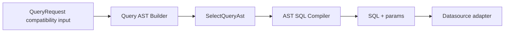

# @zhongmiao/meta-lc-query

English | [中文文档](./README_zh.md)

## Package Role

`query` compiles platform query AST into SQL and parameter lists. It is an AST-first compiler package, not a database executor or orchestration layer.

## Responsibilities

- Define query AST, compiler input, and output types.
- Build `SelectQueryAst` from legacy query requests for compatibility.
- Convert AST table, fields, predicates, and limit into safe SQL fragments.
- Keep SQL generation testable without a live database.

## Relationship With Other Packages

- `runtime` calls query compilation through its query compiler adapter before datasource execution.
- `permission` can later transform query AST before final SQL compilation.
- `datasource` executes compiled SQL; `query` does not depend on `datasource`.
- `contracts` provides V2 query node shapes that runtime adapts into query compiler input.

## Minimal Flow



## Commands

```bash
pnpm --filter @zhongmiao/meta-lc-query build
pnpm --filter @zhongmiao/meta-lc-query test
```

## Boundary Notes

- Do not open DB connections here.
- Do not add runtime orchestration or BFF page request semantics here.
- Keep permission policy resolution outside this package; consume AST predicates or later permission-transformed AST.
