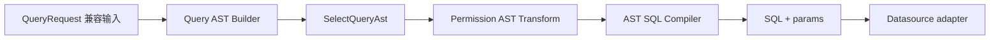

# @zhongmiao/meta-lc-query

[English](./README.md) | 中文文档

## 包定位

`query` 将平台 Query AST 编译成 SQL 与参数列表。它是 AST-first compiler 包，不是数据库执行器，也不是编排层。

## 核心职责

- 定义 Query AST、compiler 输入与输出类型。
- 为兼容旧调用，将 `QueryRequest` 构建为 `SelectQueryAst`。
- 将 AST table、fields、predicates、limit 转成安全 SQL 片段。
- 保持 SQL 生成逻辑可在无数据库环境下测试。

## 与其他包关系

- 上游：`runtime` 与 `permission`。
- 下游：无 package dependency；runtime 在执行期把编译后的 SQL 或 compiled query request 交给 `datasource`。
- `runtime` 通过 query compiler adapter 在 datasource 执行前调用 query compiler。
- `permission` 在最终 SQL 编译前 transform query AST。
- `datasource` 执行编译后的 SQL；`query` 不依赖 `datasource`。
- `runtime` 拥有 V2 query node 形状，并适配为 query compiler input。

## 最小闭环



## 常用命令

```bash
pnpm --filter @zhongmiao/meta-lc-query build
pnpm --filter @zhongmiao/meta-lc-query test
```

## 边界约束

- 不在这里打开数据库连接。
- 不在这里执行 SQL。
- 不依赖 `datasource`。
- 不在这里新增 runtime orchestration 或 BFF 页面请求语义。
- 权限策略解析留在包外；本包消费 permission-transformed AST predicates。
