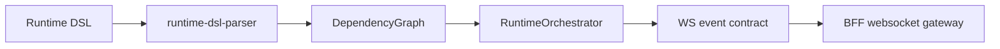

# @zhongmiao/meta-lc-runtime

English | [中文文档](./README_zh.md)

## Package Role

`runtime` contains runtime-side orchestration primitives: DSL parsing, template resolution, dependency tracking, function registry, rule evaluation, manager adapter, orchestrator, and websocket event helpers.

## Responsibilities

- Parse runtime DSL and collect dependencies.
- Track dependency changes and orchestrate refresh/action execution.
- Resolve template values from runtime state.
- Register and execute runtime functions.
- Create and validate websocket event payloads.

## Relationship With Other Packages

- Owns V2 runtime DSL, `ViewDefinition`, `ExecutionPlan`, node, runtime event, and page topic contracts directly.
- BFF websocket code can publish runtime events compatible with these contracts.
- Frontend runtime adapters consume the package contract without direct database or business API access.
- Query nodes build AST through `query`, apply `permission` AST transforms, compile SQL, and execute through the shared `datasource` adapter contract.
- BFF wires concrete datasource adapters; runtime does not read DB config or access physical data directly.
- Runtime can emit optional audit observability events for plan, node, permission, and datasource boundaries without changing execution semantics.

## Minimal Flow



## Commands

```bash
pnpm --filter @zhongmiao/meta-lc-runtime build
pnpm --filter @zhongmiao/meta-lc-runtime test
```

## Boundary Notes

- Runtime orchestration must not embed business-specific backend logic.
- Runtime consumers must still access data through BFF contracts.
- Runtime query execution must not inject SQL permission clauses; it calls the permission AST transform before SQL compilation.
- Runtime audit observers are optional and non-blocking; observer failures must not affect plan execution.
