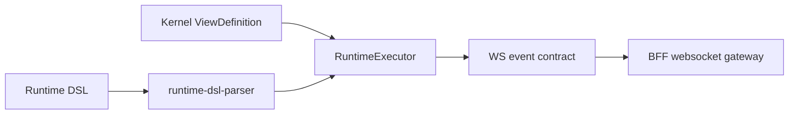

# @zhongmiao/meta-lc-runtime

English | [中文文档](./README_zh.md)

## Package Role

`runtime` is the single execution core. It owns `RuntimeExecutor`, execution contracts, runtime context, DAG/state execution, runtime gateway execution wiring, interaction execution helpers, expression evaluation, and websocket event helpers.

`RuntimeExecutor.execute()` is the only bottom execution entry. `runtime-view.facade.ts` is the high-level page/view facade, and `runtime-interaction.facade.ts` is the high-level interaction/WebSocket facade; both facades eventually route execution semantics through the runtime-owned executor layer.

## Responsibilities

- Parse runtime DSL and collect dependencies.
- Track dependency changes and plan refresh/action execution through RuntimeExecutor APIs.
- Execute page requests through the runtime gateway facade: view lookup, context build, injected org-scope/datasource dependency handoff, audit observation, and `RuntimeExecutor` execution.
- Resolve template values from runtime state.
- Register and execute runtime functions.
- Create and validate websocket event payloads.

## Relationship With Other Packages

- Upstream: `bff`.
- Downstream: `kernel`, `permission`, `query`, `datasource`, and `audit`.
- Owns execution contracts such as `ExecutionPlan`, `ExecutionNode`, `Expression`, `RuntimeContext`, runtime event, and page topic contracts directly.
- Consumes structure contracts such as `ViewDefinition` and node definitions from `kernel`.
- BFF websocket code can publish runtime events compatible with these contracts.
- Frontend runtime adapters consume the package contract without direct database or business API access.
- Query nodes build AST through `query`, apply `permission` AST transforms, compile SQL, and execute through the shared `datasource` adapter contract.
- Runtime consumes injected execution dependencies for page execution; BFF does not construct datasource, permission, org-scope, or audit dependencies.
- Demo-specific view seeds and mutation adapters are injected from `examples/*`; runtime defaults stay platform-only.
- Runtime can emit optional audit observability events for plan, node, permission, and datasource boundaries without changing execution semantics.
- `src/infra/adapters/**` contains runtime-consumed adapter contracts/ports, not package-owned infrastructure implementations.

## Minimal Flow



## Commands

```bash
pnpm --filter @zhongmiao/meta-lc-runtime build
pnpm --filter @zhongmiao/meta-lc-runtime test
```

## Boundary Notes

- RuntimeExecutor is the only execution engine; do not add runtime orchestrator modules.
- Page execution must enter through the runtime gateway facade and then `RuntimeExecutor`; do not add orchestrator or manager-adapter modules.
- Keep `runtime-executor.ts`, `runtime-view.facade.ts`, and `runtime-interaction.facade.ts` names distinct: executor is the engine, view/interaction are facades.
- Runtime query execution must not inject SQL permission clauses; it calls the permission AST transform before SQL compilation.
- Runtime audit observers are optional and non-blocking; observer failures must not affect plan execution.
- Do not add default business demo wiring to the runtime facade.
