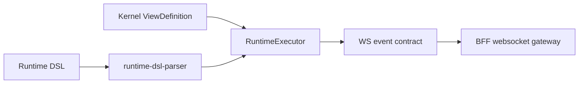

# @zhongmiao/meta-lc-runtime

[English](./README.md) | 中文文档

## 包定位

`runtime` 是唯一执行核心。它拥有 `RuntimeExecutor`、执行契约、runtime context、DAG/state execution、runtime gateway execution wiring、interaction execution helper、expression evaluation 与 websocket event helper。

`RuntimeExecutor.execute()` 是唯一底层执行入口。`RuntimeViewExecutor` 是页面/view 高层 facade，`RuntimeInteractionExecutor` 是 interaction/WebSocket 高层 facade；两个 facade 的执行语义最终都进入 runtime 拥有的 executor 层。

## 核心职责

- 解析 runtime DSL 并收集 dependencies。
- 跟踪 dependency changes，并通过 RuntimeExecutor API 规划 refresh/action execution。
- 通过 runtime gateway facade 执行页面请求：view lookup、context build、org-scope resolution、datasource wiring、audit observation 与 `RuntimeExecutor` 执行。
- 从 runtime state 解析 template value。
- 注册并执行 runtime function。
- 创建与校验 websocket event payload。

## 与其他包关系

- 直接拥有 `ExecutionPlan`、`ExecutionNode`、`Expression`、`RuntimeContext`、runtime event 与 page topic 等执行契约。
- 从 `kernel` 消费 `ViewDefinition` 与 node definition 等结构契约。
- BFF websocket code 可以发布与这些 contract 兼容的 runtime event。
- 前端 runtime adapter 消费本包 contract，但不直连数据库或业务 API。
- Query node 通过 `query` 构建 AST，经过 `permission` AST transform 后编译 SQL，并通过共享 `datasource` adapter 契约执行。
- Runtime 负责装配页面执行所需的具体依赖；BFF 不构造 datasource、permission、org-scope 或 audit dependency。
- Runtime 可以在 plan、node、permission、datasource 边界发出可选 audit observability event，但不改变执行语义。
- `src/infra/adapter/**` 放的是 runtime 消费的 adapter contract/port，不是 runtime 自己的 infra implementation。

## 最小闭环



## 常用命令

```bash
pnpm --filter @zhongmiao/meta-lc-runtime build
pnpm --filter @zhongmiao/meta-lc-runtime test
```

## 边界约束

- RuntimeExecutor 是唯一执行引擎；禁止再新增 runtime orchestrator module。
- 页面执行必须进入 runtime gateway facade，再进入 `RuntimeExecutor`；禁止新增 orchestrator 或 manager-adapter module。
- 保持 `runtime-executor.ts`、`runtime-view-executor.ts`、`runtime-interaction-executor.ts` 三层命名：executor 是引擎，view/interaction 是 facade。
- Runtime query execution 不能注入 SQL permission clause；必须在 SQL 编译前调用 permission AST transform。
- Runtime audit observer 必须保持可选、非阻塞；observer 失败不得影响 plan execution。
