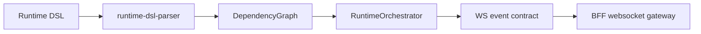

# @zhongmiao/meta-lc-runtime

[English](./README.md) | 中文文档

## 包定位

`runtime` 包含 runtime 侧编排原语：DSL parsing、template resolution、dependency tracking、function registry、rule evaluation、manager adapter、orchestrator 与 websocket event helper。

## 核心职责

- 解析 runtime DSL 并收集 dependencies。
- 跟踪 dependency changes，并编排 refresh/action execution。
- 从 runtime state 解析 template value。
- 注册并执行 runtime function。
- 创建与校验 websocket event payload。

## 与其他包关系

- 依赖 `contracts` 获取共享 runtime event 与 page topic contract。
- BFF websocket code 可以发布与这些 contract 兼容的 runtime event。
- 前端 runtime adapter 消费本包 contract，但不直连数据库或业务 API。
- `query`、`permission`、`datasource` 仍是 BFF 编排的服务端关注点。

## 最小闭环



## 常用命令

```bash
pnpm --filter @zhongmiao/meta-lc-runtime build
pnpm --filter @zhongmiao/meta-lc-runtime test
```

## 边界约束

- Runtime orchestration 不能内嵌业务专用后端逻辑。
- Runtime consumer 的数据访问仍必须经过 BFF contract。
