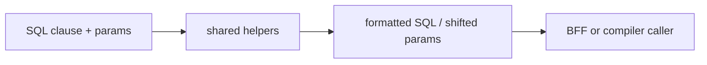

# @zhongmiao/meta-lc-shared

English | [中文文档](./README_zh.md)

## Package Role

`shared` provides small reusable helpers shared across platform packages. The current surface focuses on SQL identifier quoting, literal quoting, parameter formatting, and parameter index shifting.

## Responsibilities

- Validate and quote SQL identifiers.
- Quote primitive SQL literals and arrays for readable final SQL output.
- Shift positional SQL parameter markers when composing clauses.

## Relationship With Other Packages

- Intended for packages that need common SQL formatting behavior.
- Kept separate from `query` and `datasource` so low-level helpers do not pull in compilers or DB adapters.
- Included by `platform` as a foundational utility package.

## Minimal Flow



## Commands

```bash
pnpm --filter @zhongmiao/meta-lc-shared build
pnpm --filter @zhongmiao/meta-lc-shared test
```

## Boundary Notes

- Keep helpers deterministic and side-effect free.
- Do not add package-specific orchestration here.
