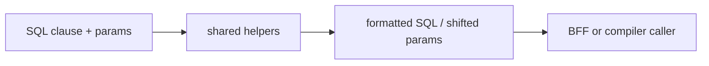

# @zhongmiao/meta-lc-shared

[English](./README.md) | 中文文档

## 包定位

`shared` 提供平台包之间复用的小型工具。当前公开能力聚焦 SQL identifier quoting、literal quoting、参数格式化与参数下标偏移。

## 核心职责

- 校验并 quote SQL identifier。
- quote primitive SQL literal 与数组，用于生成可读 final SQL。
- 在组合 SQL clause 时调整 positional parameter 下标。

## 与其他包关系

- 面向需要通用 SQL formatting 行为的包。
- 与 `query`、`datasource` 分离，避免底层工具反向依赖 compiler 或 DB adapter。
- 被 `platform` 纳入基础工具包集合。

## 最小闭环



## 常用命令

```bash
pnpm --filter @zhongmiao/meta-lc-shared build
pnpm --filter @zhongmiao/meta-lc-shared test
```

## 边界约束

- 保持工具函数确定性和无副作用。
- 不在这里加入某个包专属的编排逻辑。
